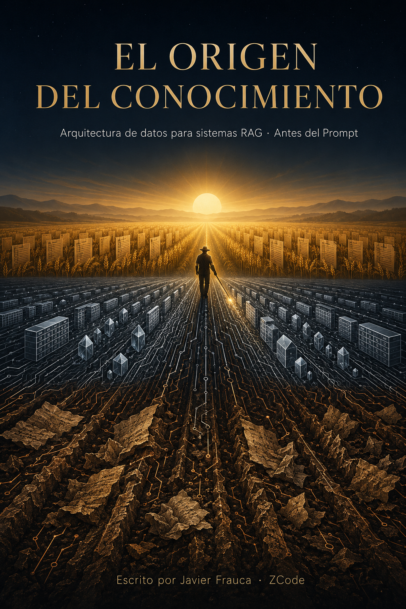

# EL ORIGEN DEL CONOCIMIENTO

**Arquitectura de Datos para Sistemas RAG — Antes del Prompt: la ingeniería del dato que alimenta a la IA**

> Todo el mundo enseña a preguntarle a la IA. Nadie enseña qué se le da a comer. El 80% del éxito de un RAG ocurre antes del prompt.

Libro técnico gratuito, escrito por **Javier Frauca** en coautoría con **ZCode** (GLM, Z.ai) y — lo más importante — **mientras se construía un RAG real**: el de un despacho laboral. Por eso sus páginas están pobladas de convenios, tablas salariales y un IRPF del 19% que contradice al del 21%. 🌾

## El método en una línea

**Documentos dispersos → Dominios → Bronce → Silver → Gold → Rack validado → Mantenimiento idempotente.**

| Fase | Capítulos |
|---|---|
| I · Cimientos (scoping, fuentes, linaje) | 1–3 |
| II · Bronce (zona cruda, manifiesto) | 4–5 |
| III · Hacia Silver (normalización, curado, segmentación, clasificación) | 6–9 |
| IV · Silver semántico (chunking, tablas, doble campo) | 10–12 |
| V · Gold (auditoría, síntesis, marcaje) | 13–15 |
| VI · Gobierno (dataset áureo, aceptación, ciclo de vida, corpus maestro, frescura, coste, CD) | 16–22 |

## Leerlo

📖 **[Leer el libro completo en GitHub Pages](https://javierfrauca.github.io/el-origen-del-conocimiento/)** — o directamente en este repo, dentro de [`book/`](book/), capítulo a capítulo.

## Lo que encontrarás (una muestra)

- 🧭 **La píldora de información** — por qué el tamaño del chunk no se elige: se hereda del dominio (cap. 2 y 10)
- 🪙 **Bronce, Silver, Gold** — la Arquitectura Medallón aplicada al conocimiento no estructurado
- 🔄 **La idempotencia documental** — *"una base de datos sana, un RAG feliz"* (caps. 1, 5, 10, 18)
- 🥇 **La capa Gold human-guided** — síntesis firmadas por expertos que resuelven contradicciones (caps. 13–15)
- 🧪 **Validación medible** — dataset áureo, Recall ≥ 90% o cero, no-deployment (caps. 16–17)
- 🌱 **El corpus maestro como activo oro**, en Git, con CD (caps. 19, 20, 22)
- 💰 **El coste del conocimiento** — crearlo y mantenerlo, por etapas y verificable (cap. 21)

## Licencia y citación

[CC BY-NC-SA 4.0](LICENSE.md) — comparte y adapta con atribución, sin uso comercial, compartiendo igual.

> Frauca, J., & ZCode (GLM, Z.ai). *El Origen del Conocimiento: Arquitectura de Datos para Sistemas RAG — Antes del Prompt*. 2026. Licencia CC BY-NC-SA 4.0.

🤖 *Coautoría humano-IA declarada: el libro se escribió mientras se construía el RAG que lo demuestra.*

