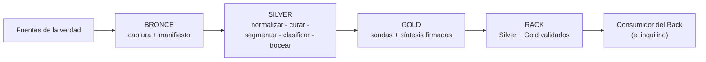

# Capítulo 1: La cadena de suministro del conocimiento

## La lección que la comida ya aprendió

Nadie discute que una fábrica de alimentos necesita trazabilidad desde la materia prima hasta el lineal. Cuando hay un brote sanitario, en cuestión de horas se identifica el lote, la granja, el transporte y la fecha exacta de entrada en el circuito — y se retira solo lo afectado, no toda la despensa. Esa capacidad se construyó a base de normativa, costes y varias crisis públicas; hoy nadie la cuestiona, y el producto que llega sin ella no se vende.

Con el conocimiento empresarial hacemos exactamente lo contrario. Lo volcamos crudo en un sistema — carpetas heredadas, escaneados de teléfono, borradores conviviendo con vigentes — y esperamos respuestas fiables. Cuando la respuesta es errónea, no podemos decir ni siquiera *de qué documento* salió, mucho menos en qué eslabón se corrompió la información. No hay lote, no hay granja, no hay fecha. Hay un asistente respondiendo con seguridad desde una pizarra donde todos los documentos son iguales de fiables y de dudosos a la vez.

Este libro defiende que el conocimiento que alimenta a una IA es una **materia prima con cadena de valor**, y que esa cadena tiene eslabones identificables, cada uno con su control de calidad:

1. **Existe** — el documento original, en su formato nativo, en alguna fuente de la verdad.
2. **Se captura** — se copia a una zona segura, intacto e inventariado.
3. **Se entiende** — se normaliza, se limpia, se segmenta y se trocea sin perder sentido.
4. **Se sintetiza** — se resuelven contradicciones y se produce la verdad única.
5. **Se demuestra** — se valida con pruebas medibles antes de dar acceso a nadie.

Cada eslabón que se salta se paga después, con intereses, en forma de respuestas erróneas que nadie sabe depurar. El resto del libro es el desarrollo de estos cinco eslabones; este capítulo es su mapa y su filosofía.

## Garbage in, garbage out: el amplificador

El principio más viejo de la informática sigue siendo el más ignorado en la era de la IA, y conviene reformularlo para nuestros tiempos: un modelo de lenguaje es un **amplificador**. No un oráculo, no un filtro, no un corrector. Un amplificador.

Lo que hace el modelo con el contexto que recibe es razonar sobre él — con una capacidad de análisis lingüístico que asombra — pero **jamás lo audita**. No comprueba si el dato contradice a otro que llegó en otro chunk. No sabe que aquel borrador nunca se promulgó. No detecta que la tabla está mal leída por el OCR, porque para él "21,5O€" es un texto tan válido como "21,50€". Todo lo que entra, sale procesado: lo bueno sale mejor presentado, lo malo sale también mejor presentado.

De ahí la consecuencia más incómoda del amplificador: **la fluidez enmascara la calidad del origen**. Antes de la IA generativa, el documento mal escaneado llegaba al usuario con sus faltas y sus cortes, y desconfiaba — razonablemente. Ahora llega como una respuesta redactada con impecable ortografía y estructura, con la fuente citada, y el usuario confía — razonablemente también, porque nada en la superficie delata el problema. La tecnología hizo invisible el síntoma más útil que teníamos: la torpeza delante de la que antes avisaba.

Y de ahí la regla de gobierno: **la calidad de entrada es la única métrica que importa a largo plazo**. Los ajustes del modelo son visibles e inmediatos; la calidad del dato es invisible y estructural. Los proyectos que fracasan no fracasan por el modelo — fracasan porque en el eslabón 3 alguien decidió que "eso lo limpiamos después". Después, en estos proyectos, se llama producción.

## El principio de idempotencia documental

Hay una propiedad técnica que este libro eleva a concepto central, con nombre propio y derecho a sección: la **idempotencia documental**. Arranca de la definición clásica — un proceso es idempotente cuando ejecutarlo dos veces produce el mismo resultado que ejecutarlo una — y la aplica al documento como unidad de conocimiento: **si la fuente original no cambia, nada posterior a ella cambia; y si nada posterior cambia, no hay motivo para re-procesar nada.**

La cadena causal se enuncia en tres pasos y se cumple sin excepción en todo el método:

1. Si el PDF (o la fuente original) no cambia, su **huella digital** (`hash_sha256`) no cambia.
2. Si la huella no cambia, el documento curado y su resumen no cambian.
3. Si el resumen curado no cambia, **no hay motivo de re-ingestión**: el documento no se vuelve a tocar, y sus chunks siguen siendo válidos exactamente como están.

Y la lectura inversa, que es la que define la sincronización del Rack con sus fuentes:

1. Si el original **cambia** (la huella difiere), el documento se re-procesa de arriba abajo — y su estado anterior se **retira**: los chunks viejos salen del índice y entran los nuevos. Nunca conviven.
2. Si el original **desaparece** del repositorio de origen, el documento **sale de la base**. Un chunk cuyo origen ya no existe es un fantasma esperando su turno — el modo fantasma del prólogo, fabricado por omisión.

Y el lema que el método repite como definición operativa de calidad: **una base de datos sana, un RAG feliz**. Sin residuos, sin duplicados, sin zombis, sin fantasmas.

Puede parecer un detalle de ingeniería. Es, en realidad, la diferencia entre un sistema que puede aprender y uno condenado a degenerar. Un sistema de conocimiento vivo re-procesa constantemente: llega una nueva versión de una política y hay que sustituir la anterior; cambia la estrategia de troceado y hay que re-hacer los chunks; se corrige una clasificación y hay que propagarla. Cada una de esas operaciones, sobre un sistema no idempotente, deja residuos: la versión vieja que nunca murió, los chunks duplicados del re-procesado, la etiqueta corregida en un registro pero no en su copia. Los residuos se acumulan, y el sistema se degrada sola y de forma silenciosa — fabricada por nuestro propio pipeline.

El método consigue la idempotencia documental con dos mecanismos sencillos que recorrerán todas las fases:

- La **huella digital** del original (`hash_sha256`): el contenido del documento identifica al documento, no su nombre ni su ruta. El mismo convenio llega como `convenio.pdf`, como `convenio_final(2).pdf` o por correo: la huella es la misma, y el sistema sabe que ya lo conoce.
- La **clave de concepto** (`concepto_unico`): cada verdad sintetizada del sistema (los documentos Gold de la Parte V) lleva el nombre único del concepto que explica. Re-ingesta de la misma verdad: actualización. Segunda verdad para el mismo concepto: señal de alarma.

Y un compromiso de autoría con el lector: la idempotencia documental es un **concepto transversal y base de la calidad de la base de datos**, y como tal estará **definido y documentado durante todo el libro**, en cada fase donde actúa. Se verá en el manifiesto (cap. 5: la huella decide si algo se re-procesa), en el troceado (cap. 10: la re-ingesta sustituye los chunks; no los acumula), en la capa Gold (cap. 15: un concepto, una verdad, por UPSERT) y en la sincronización con las fuentes (cap. 18: las tres operaciones — alta, modificación, baja — formalizadas). Si el lector retiene un solo compromiso del método, que sea este: *nada cambia si no cambia el origen; y si cambia el origen, todo lo que dependía de él cambia con él — una vez, limpia, sin residuos.*

Con ambos mecanismos, la frase más tranquilizadora que un pipeline puede ofrecer es posible: ***el proceso se puede relanzar sin miedo***. Relanzar un proceso no idempotente es abrir el grifo de los duplicados; relanzar uno idempotente es repetir una orden. La diferencia, en la operación diaria, es dormir o no dormir.

## La Arquitectura Medallón aplicada al RAG

La industria del dato estructurado lleva años resolviendo un problema análogo — datos que llegan sucios, de muchas fuentes, con calidades heterogéneas — con un patrón consolidado: la **Arquitectura Medallón** (*Medallion Architecture*), que organiza los datos en capas de calidad creciente. Este libro la aplica al conocimiento no estructurado, y no como guiño estético sino como columna vertebral del método:

| Capa | Nombre | Qué contiene | En una frase |
|---|---|---|---|
| **Bronce** | Materia prima | Los originales, intactos, en zona cruda e inventariados | *Lo que tenemos* |
| **Silver** | Conocimiento estructurado | Texto normalizado, limpio, segmentado, etiquetado y troceado | *Lo que sabemos* |
| **Gold** | Conocimiento sintetizado | Documentos de síntesis, definidos, escritos y corregidos por expertos del dominio (capa human-guided) | *Lo que entendemos* |

El recorrido completo, en un vistazo:

Las tres distinciones importan porque las capas responden a **preguntas distintas**:

- **Bronce** responde a "¿de dónde salió esto?" — es la capa de trazabilidad y re-procesado. Nadie la consulta para saber; se consulta para verificar.
- **Silver** responde a "¿qué dice exactamente cada fuente?" — hechos atómicos, verificables, con autoría. La capa de los detalles.
- **Gold** responde a "¿qué debemos creer cuando las fuentes discrepan o se dispersan?" — la interpretación autorizada. La capa de las decisiones.

Visto con el caso que recorrerá el libro. El convenio colectivo, un PDF de 210 páginas, existe como:

- **Bronce**: `convenio-sector-2025.pdf`, byte a byte idéntico al original de la fuente, con su fila en el manifiesto y su huella digital.
- **Silver**: dividido en tres documentos atómicos (tablas salariales, articulado, anexos), convertidos a Markdown, limpios, clasificados en RRHH y Finanzas, troceados en chunks con contexto.
- **Gold**: un documento de síntesis adicional, escrito por un experto, que explica "las condiciones económicas del convenio 2025" cruzando tablas y articulado, y que algún día — cuando sustituyan el convenio — declarará qué queda derogado y qué sobrevive.

El mismo conocimiento, tres estados de madurez, tres utilidades. Y una regla de distribución que anticipa decisiones de la Parte V: **el Rack — la base vectorial que se consulta — solo contiene Silver y Gold**. El Bronce vive en almacenamiento barato, como el sótano al que solo bajamos cuando perdemos la llave: para re-procesar, para auditar, para reconstruir. Nunca para responder.

> **El nombre, para que no haya confusiones.** A esa base la llamamos **Rack** — es un bautismo, un nombre propio del método. Conviene desarmar dos malentendidos de entrada:
>
> **Primero**: no son los racks de servidores del centro de datos. Aquellos tienen botón de apagado; este no.
>
> **Segundo**: Rack no es lo mismo que **corpus**. El **corpus** es el contenido — la colección de documentos y conocimiento que la organización posee. El **Rack** es el contenedor que lo sirve — la base donde ese contenido queda organizado, embebido y disponible para quien pregunte. El corpus es lo que sabes; el Rack, donde lo sabes puesto a disposición.
>
> La diferencia puede parecer de abogados ahora, pero se vuelve protagonista en el capítulo 19 — donde descubrirás que el corpus maestro es el capital y el Rack, el derivado que se reconstruye en una noche. Lleva la distinción grabada desde la primera página: **el corpus es lo que tienes; el Rack, donde lo tienes.**

## Dos mentalidades frente al modelo

Todo lo anterior cabe en un cambio de marco mental. Cuando algo falla en un sistema de conocimiento, hay dos maneras de mirarlo:

| | Mentalidad prompt | Mentalidad origen |
|---|---|---|
| Pregunta ante un error | "¿Cómo le pido al modelo que tenga cuidado con esto?" | "¿Cómo ha entrado esto en el índice sin estar resuelto?" |
| Invierte en | Frameworks, técnicas de prompt, agentes | Manifiestos, curado, validación |
| El modelo es | El producto | El inquilino |
| El conocimiento es | Una carpeta de documentos | Una cadena de suministro con control de calidad |
| "Funciona" significa | "La demo convence" | "La suite de validación pasa" |
| Fracasa por | — (siempre tiene un motivo externo) | Y cuando fracasa, sabe por dónde |

La mentalidad prompt no es tonta: la parte visible del sistema *también* importa. Pero es la mentalidad del 20%. Este libro es el otro 80: la disciplinada, la invisible, la que decide.

## Qué hace un arquitecto del dato (y qué no)

Conviene acotar el papel, porque el título se presta a confusión. El arquitecto del dato de este libro **no** entrena modelos, no escribe el chat de producción, no hace fine-tuning. Construye y gobierna el activo que hay debajo: diseña dominios, mapea fuentes, dirige el curado, define las etiquetas, decide el troceado, arbitra los conflictos de verdad, sostiene la suite de validación.

Es, dicho de otra forma, el dueño de la cadena de suministro. Y como todo dueño de cadena de suministro, su éxito se mide por una paradoja: cuanto mejor hace su trabajo, más invisible resulta — porque lo único que se ve es que el sistema responde bien. Que nadie haya visto jamás el manifiesto del Bronce es, precisamente, la señal de que está funcionando.

## Lo que viene

El recorrido del libro sigue la cadena de suministro en orden natural:

- **Parte I**: los cimientos — filosofía, acotado de dominios y mapeo de fuentes.
- **Parte II**: la capa Bronce — ingesta inmutable e inventario.
- **Parte III**: la transformación — normalización, curado, segmentación y clasificación.
- **Parte IV**: la capa Silver — troceado semántico, tablas atómicas y estrategia del doble campo.
- **Parte V**: la capa Gold — auditoría, síntesis y marcaje.
- **Parte VI**: gobierno — validación, aceptación, ciclo de vida, el corpus maestro como activo, el mantenimiento al día, el coste del conocimiento, la ejecución repetible y las deudas intelectuales del método.

Un aviso honesto antes de empezar: las primeras partes parecerán lentas. Son las que no salen en las demos. Son también las que deciden si el sistema funcionará.

!!! quote "Regla del capítulo"
    el modelo amplifica; no audita. Todo lo que entra — bueno y malo — sale mejor presentado. Por eso la calidad del origen no es una fase del proyecto: es el proyecto.

