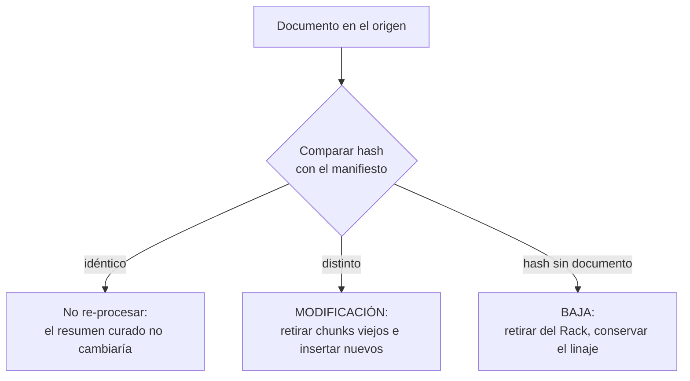

# Capítulo 5: El manifiesto de datos (Data Manifest)

## Las cinco hojas de cálculo

En el proyecto donde aprendí esto de la manera dura, la pregunta **"¿está procesado este documento?"** tenía cinco respuestas correctas, según a quién se la hiceras. La analista llevaba una hoja de cálculo con las fases de curado; el becario, otra con los OCR pendientes; el líder técnico, un script que pintaba estados en consola *cuando se acordaba de ejecutarlo*; el jefe de proyecto, un tablero actualizado los viernes; y alguien, en alguna carpeta, tenía un Excel llamado `PENDIENTES_definitivo_FINAL(2)`. Las cinco fuentes no coincidían entre sí en nada — ni siquiera en el número total de documentos. El pipeline se ejecutó dos veces un mismo fin de semana por dos personas que creían, con razón cada una según su hoja, que la primera pasada no había terminado. Nadie supo nunca cuántos duplicados dejó aquello, porque detectarlos exigía... un inventario.

El manifiesto existe para que esa escena sea imposible. Un único archivo estructurado — CSV o JSON, da igual el formato; importa la disciplina — donde **cada documento capturado es una fila** y cada propiedad relevante es una columna. Su función es simple de enunciar y revolucionaria en la práctica: ser la **única fuente de verdad sobre el estado del proceso**. Qué se ha capturado, de dónde, cuándo, con qué huella digital, en qué fase está, a qué dominio pertenece. Antes del manifiesto, el conocimiento sobre el pipeline vive en cabezas y hojas paralelas que divergen; con el manifiesto, vive en un único lugar consultable, auditable y — esta es la palabra clave — **compartido**.

De aquí la regla más citada de este libro: ***"si no está en el manifiesto, no existe"***. Un documento capturado sin fila en el manifiesto no es un documento gestionado: es un desconocido dentro del edificio — nadie sabe de dónde vino, nadie sabrá si está procesado, y cuando dé problemas (los dará), nadie sabrá ni que está ahí.

## Los campos, uno a uno

| Campo | Contenido | Para qué sirve |
|---|---|---|
| `doc_id` | Identificador único (UUID) | La referencia estable que todas las capas usan para hablar del documento |
| `hash_sha256` | Huella digital del contenido | Detectar duplicados aunque cambien nombre o ubicación; base de la idempotencia |
| `ruta_origen` | Ubicación exacta de la fuente | Linaje: de dónde salió |
| `nombre_original` | Nombre del archivo tal cual llegó | Referencia humana |
| `tamano_bytes` | Tamaño | Sanity checks; detectar capturas truncadas |
| `fecha_captura` | Cuándo entró al Bronce | Linaje temporal |
| `fecha_modificacion_origen` | Última modificación en la fuente | Saber si hay algo más nuevo fuera |
| `tipo_contenido` | PDF, DOCX, XLSX, imagen, correo... | Encaminar el tratamiento (OCR, parsing) |
| `dominio` | Dominio asignado (cap. 9) | Clasificación primaria |
| `labels` | Facetas transversales (cap. 9) | Año, vigencia, confidencialidad... |
| `estado` | Fase del ciclo de vida | El tablero de control (ver tabla propia) |
| `notas` | Texto libre de incidencias | La memoria institucional del documento |

Cuatro filas merecen comentario por encima de las demás.

**El `doc_id` es para siempre.** Es la clave que los chunks citarán, que los Gold enlazarán, que las incidencias mencionarán. Nace con el documento y nunca se recicla: reutilizar el identificador de un documento borrado es sembrar falsos linajes. Y es opaco a propósito — un `doc_id` que "explica" algo por su texto (`convenio_2025_final_OK`) volverá a ser mentira en la primera corrección.

**El `hash_sha256` es del contenido, no del nombre.** El error más común del primer día: hashear el nombre del archivo. Los nombres mienten, se duplican y cambian; el contenido no — el capítulo siguiente desarrolla toda su mecánica.

**La `fecha_modificacion_origen` es el campo que permite la ingesta incremental.** Es la que responde "¿ha cambiado esto en la fuente desde la última captura?" — el motor del delta del capítulo 4 y del CDC del capítulo 18.

**Las `notas` son memoria institucional, no relleno.** Las buenas notas son las que dentro de un año evitan volver a descubrir lo mismo: *"escaneado con páginas rotadas, corregido en curado el 14-03"*, *"contraseña en el PDF, disponible en gestoría"*, *"copia local del BOE, autoridad baja: solo contexto interno"*. Un manifiesto sin notas es un manifiesto anónimo; el valor histórico está en las anotaciones de los bordes.

## La huella digital: el fin de los duplicados

El `hash_sha256` merece su propia sección porque resuelve, de raíz, el problema más común de cualquier recopilación masiva: el **duplicado camuflado**. El mismo convenio existe como `convenio_2025.pdf`, como `convenio_2025_final.pdf` y como `copia (3) de convenio.pdf` — en tres carpetas, de dos fuentes distintas. Los nombres difieren; las fechas difieren; el contenido, no. El hash es idéntico, y el manifiesto lo detecta en milisegundos, mientras que cualquier otro método (nombre, tamaño, fecha) falla con elegancia en algún caso.

Reglas de uso:

- **Al capturar, si el hash ya existe, no se duplica**: se añade una ruta de origen alternativa a la fila existente. El duplicado no se pierde como información — la existencia de múltiples orígenes es, en sí, un dato de linaje — pero no se acumula como peso.
- **El hash identifica contenido, no documento lógico.** Dos versiones distintas del mismo convenio tendrán hashes distintos, y ambas filas son legítimas: cada una con su vigencia (la 2024 `deprecada`, la 2025 `vigente`). Lo de "qué versión manda" es trabajo de las facetas del capítulo 9 y, en el límite, de la capa Gold. Confundir *mismo contenido* (duplicado) con *mismo documento lógico* (versiones) es el error que produce sistemas que "resuelven" duplicados borrando historia.
- **El hash también protege contra capturas parciales.** Un PDF cortado por un timeout captura, y su hash se compara en la reingesta: si la nueva captura del mismo archivo produce otro hash, algo cambió — o se completó. El hash es el árbitro silencioso de la calidad de la propia copia.
- **El hash es el gatillo de la idempotencia documental** (cap. 1). La comparación de huellas decide toda la vida posterior del documento: hash idéntico al registrado → no se re-procesa nada (el resumen curado no cambiaría: no hay motivo); hash distinto → el original cambió, y se activa el ciclo completo: re-procesar, retirar los chunks viejos, insertar los nuevos. Y hash registrado sin documento en origen → baja: el documento sale del Rack. Una columna del manifiesto toma, sola, la decisión que en los proyectos sin método se toma a ojo cada semana.

Y una frontera que el manifiesto no cruza jamás: el hash deduplica **copias idénticas** — nunca información. Dos documentos distintos y legítimos que cuentan el mismo hecho (una norma y su guía de aplicación, por ejemplo) se mantienen **los dos**: esa redundancia entre fuentes es resiliencia del sistema, no residuo del pipeline (cap. 13). Deduplicar contenido semántico equivalente fabricaría un punto único de fallo: muerto el documento que guardaba el único chunk, muerta la información.

El gatillo, visto como diagrama:

## Los estados: el tablero de control

La columna `estado` convierte el manifiesto en un tablero de control del pipeline. Los valores evolucionan con las fases del libro:

| Estado | Significado | Fase que lo establece |
|---|---|---|
| `RAW_INGESTED` | Capturado e inventariado, sin tratar | Cap. 4 (Bronce) |
| `NORMALIZED` | Convertido al formato canónico | Cap. 6 |
| `CLEANED` | Curado: paja eliminada, tablas intactas | Cap. 7 |
| `SEGMENTED` | Segmentado temáticamente si procede | Cap. 8 |
| `CLASSIFIED` | Dominio y facetas asignados y verificados | Cap. 9 |
| `AUDITED` | Fidelidad verificada al 100% contra el master canónico (auditoría LLM) | Cap. 9 |
| `SILVER_CHUNKED` | Troceado y disponible en el Rack como Silver | Cap. 10–12 |
| `GOLD_SYNTHESIZED` | Base de (o sustentado por) un documento Gold | Cap. 14–15 |
| `VALIDATED` | Superada la suite de aceptación | Cap. 17 |
| `DEPRECATED` | Obsoleto pero conservado | Cap. 18 |

La disciplina que da valor al tablero son dos reglas de propiedad. **Cada fase es dueña de su transición**: quien normaliza marca `NORMALIZED`, quien clasifica marca `CLASSIFIED` — nadie salta fases ni marca estados de fases ajenas, porque un estado mentiroso es peor que un estado ausente (el ausente pide ayuda; el falso la desvía). **Y todo cambio queda registrado con fecha**: la pregunta "¿en qué estado está este documento y quién lo tocó por última vez?" tiene siempre respuesta en un solo sitio.

Con el tablero funcionando, preguntas que antes exigían cinco hojas de cálculo se responden con una consulta: ¿cuántos documentos están a medio procesar? ¿qué quedó detenido entre curado y clasificación hace tres semanas? ¿cuántos entraron desde la última validación? El manifiesto es, de paso, el primer panel de control honesto del proyecto.

## El manifiesto como contrato de equipo

Una dimension que se descubre en la operación: el manifiesto es también un **contrato social**. Lo escribe quien ejecuta cada fase, pero lo leen todos — el auditor que verifica la exclusión RGPD, el responsable de dominio que busca qué hay pendiente, el recién incorporado cuya primera tarea es leerse el manifiesto para entender qué es el Rack (la mejor formación de incorporación que existe: la historia completa del activo, documento a documento). Y lo hereda el futuro: cuando haya que reconstruir el pipeline desde cero — nueva herramienta, nueva plataforma — el manifiesto es lo único que **no se reconstruye: se hereda**.

Por eso el formato importa menos que la disciplina: un CSV sin pretensiones que todo el mundo actualiza vale más que una base de datos de gobierno impecable que solo toca quien la creó. El manifiesto perfecto es el que está vivo.

## Errores frecuentes con el manifiesto

**La hoja de cálculo paralela.** El manifiesto oficial existe, pero "para lo rápido" se usa la hojita de siempre. Dos fuentes de verdad son cero: en cuanto divergen, cada lectura es una apuesta. Si la hojita hace algo que el manifiesto no hace, la respuesta es añadirlo al manifiesto — no mantener un mundo paralelo.

**El manifiesto parcial.** Inventariar solo el Bronce y abandonar el tracking en las fases siguientes ("eso ya lo gestiona el pipeline"). El estado de los documentos es información de primer nivel hasta el final; un manifiesto que solo cuenta la infancia de cada documento no permite auditar su vida adulta.

**Los estados decorativos.** Estados que se asignan una vez al principio y no vuelven a moverse — sobre todo el temible `VALIDATED` que en realidad significa "alguien confía". Los estados mienten cuando no tienen dueño por fase ni fecha de cambio; un tablero con estados mentirosos es más peligroso que ningún tablero, porque da confianza falsa.

**El hash del nombre.** Hashear `nombre_archivo` en lugar del contenido: el mismo convenio con tres nombres genera tres "documentos distintos", y el mismo nombre con contenido distinto (el clásico `convenio.pdf` de cada año) se cree duplicado. El nombre es una etiqueta; el contenido, la identidad.

**El `doc_id` reciclado.** Borrar un documento y reutilizar su identificador para otro. Los linajes antiguos — chunks, Gold, incidencias que lo citan — apuntarán ahora al desconocido nuevo. Los identificadores se agotan y se jubilan; no se heredan.

!!! quote "Regla del capítulo"
    el manifiesto no es documentación del proyecto; es el proyecto. Si un día hay que reconstruir todo el pipeline desde cero, el manifiesto es lo único que no se reconstruye: se hereda.

