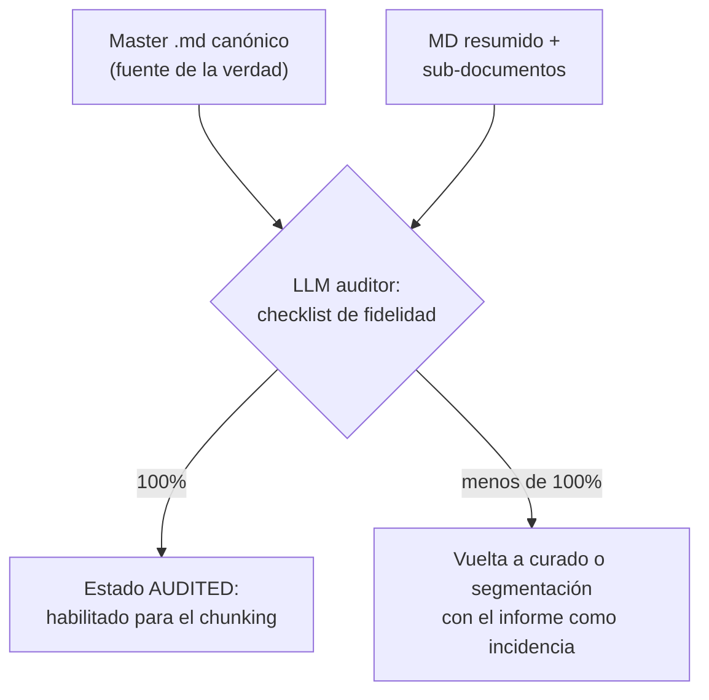

# Capítulo 9: Clasificación facetada y etiquetado (Faceted Classification)

## La biblioteca sin catálogo

Imagina una biblioteca donde los libros están ordenados por color del lomo. Funciona — hasta que buscas algo. Encontrar "la novela que me recomendaron" es un ejercicio de paciencia, y cualquier pregunta que cruce criterios ("novelas del año pasado, de autor español, aptas para adolescentes") exige recorrer la estantería entera. Las bibliotecas serias resuelven esto hace siglos con **catálogos**: fichas por autor, por materia, por año — ejes de búsqueda independientes sobre el mismo fondo.

Un Rack sin clasificación es la biblioteca por color del lomo. Los chunks están "ahí", la búsqueda vectorial los encuentra *si se parecen a la pregunta* — pero cualquier consulta estructurada ("¿qué hay de convenios de 2024 vigente?", "muéstrame solo lo confidencial de Finanzas") o no se puede hacer o depende de que la similitud haga milagros. La clasificación convierte un montón en un fondo documental: añade los ejes que la semántica no ve.

Con el corpus normalizado, limpio y atómico, esta fase responde a las dos preguntas que todo consumo se va a hacer: **¿de qué es esto?** (el dominio) y **¿qué propiedades tiene?** (las etiquetas). Y su calidad determina lo que después será posible: filtrar por dominio, filtrar por facetas, excluir lo caducado, proteger lo sensible y dar peso a lo marcado como síntesis.

## Taxonomía fija: los dominios

La clasificación por dominio es la asignación a las categorías grandes decididas en el capítulo 2. Es **fija** (la lista no crece por improvisación), **decidida** (no se negocia documento a documento sino por criterios escritos en la ficha) y **única** por documento — con una excepción que conviene tener decidida de antemano: los hijos de la segmentación pueden heredar la del padre o tenerla propia, y a veces sucede que un hijo es legítimamente multi-dominio (las tablas salariales interesan a RRHH *y* a Finanzas).

Si tu modelo de dominios no admite multi-asignación, ese cruce no se pierde: lo cubren las facetas multi-etiqueta o los documentos Gold (cap. 14), que son precisamente los especialistas en conceptos que viven en varios mundos. Lo importante no es el mecanismo elegido: es que **la decisión esté escrita**, no improvisada documento a documento.

## Facetas: las etiquetas transversales

Las facetas son ejes de clasificación que cruzan todos los dominios. A diferencia del dominio (una asignación por documento), un documento puede llevar varias facetas de cada eje. Los ejes mínimos recomendados:

| Eje | Valores típicos | Para qué sirve |
|---|---|---|
| **Temporalidad** | `2024`, `2025`... | Consultas con año; series temporales |
| **Vigencia** | `vigente`, `deprecado` | El filtro más valioso: excluir normas derogadas |
| **Naturaleza** | `legislacion`, `politica-interna`, `procedimiento`, `tabla-datos` | Tipificar el contenido |
| **Idioma** | `es`, `en`, `fr`... | El idioma del contenido original; el campo de búsqueda se normaliza al idioma objetivo del dominio (cap. 12) |
| **Confidencialidad** | `publico`, `interno`, `confidencial` | La base del control de acceso |

Reglas de oro de las facetas:

1. **Lista controlada, no folcsonomía.** Los valores posibles se definen por escrito y se validan contra lista blanca (la misma que usará la validación del cap. 17). Las etiquetas libres parecen flexibles y acaban siendo un vertedero: nadie filtra sobre una faceta con trescientos valores, y "2024", "2024 (parcial)" y "vigente-2024" son tres especies distintas del mismo error.
2. **La vigencia es obligatoria.** Cada documento entra con `vigente` o `deprecado` — sin excepciones, sin "por determinar" en producción. Un Rack sin eje de vigencia está programado para citar normas derogadas con total seguridad: es el modo fantasma del prólogo, servido por omisión.
3. **La confidencialidad es obligatoria.** Ver la sección final de este capítulo.
4. **Las facetas describen, no opinan.** Un documento lleva `legislacion`, no `importante`; `deprecado`, no `obsoleto_y_confuso`. El momento en que alguien propone etiquetar como `fiable` o `prioritario` es el momento de recordar que la relevancia es política del consumidor (rerank, Gold), no una propiedad del contenido.

## Etiquetado automático sin LLM

Clasificar miles de documentos a mano no es solo lento: es **insostenible e incoherente** — dos personas etiquetan distinto el mismo documento, y la misma persona etiqueta distinto en febrero y en julio. El método por capas:

- **Reglas primero.** Combinaciones de patrones sobre el texto ya normalizado: "contiene *tabla salarial* y estructura tabular" → `tabla-datos`; "contiene *queda derogado*" → revisar vigencia; vocabulario de la ficha del dominio → dominio. Las reglas dan lo mejor de sí con el vocabulario especializado — que es justo donde más valen, porque es el vocabulario que los usuarios usan. Un corpus típico se etiqueta al 70-80% con reglas solas.
- **Clasificadores ligeros después.** Para lo que las reglas no cubren: modelos pequeños de clasificación entrenados con ejemplos de tu propio corpus. No se necesita un LLM generativo para asignar etiquetas de lista cerrada — es un problema de clasificación, con herramientas de clasificación.
- **El LLM, si se usa, es supervisado.** Para corpus difíciles puede proponerse etiquetado con un LLM generativo — pero siempre como *propuesta* que entra en el proceso de verificación, nunca como verdad directa. El LLM propone con la misma dignidad que las reglas: ninguna etiqueta entra al manifiesto sin pasar por la auditoría del siguiente apartado.

## El muestreo humano: auditar la máquina

La clasificación automática sin auditoría es fe con estadística. El protocolo mínimo:

1. Tomar una **muestra aleatoria del 5%** del corpus clasificado — aleatoria de verdad, no "los primeros" ni "los que parezcan problemáticos".
2. Comparar la etiqueta asignada con la realidad del documento, por un experto del dominio.
3. **Umbral: si el error supera el 2%, el etiquetado no se acepta.** Se corrigen las reglas o el clasificador, y se repite el muestreo.

El 5% y el 2% no son magia: son suficientes para detectar un etiquetado roto (con 5% de 2.000 documentos, cien revisiones detectan una tasa de error real por encima del 3% con bastante seguridad) y asequibles para hacerse de verdad. Lo que no es negociable es el principio: **la máquina propone, la muestra audita, el manifiesto registra** (estado `CLASSIFIED`, con fecha y quién audito). Y una extensión que cuesta poco: las correcciones del muestreo se devuelven al equipo de reglas — cada etiqueta corregida a mano es un caso de test para la regla que falló.

## Confidencialidad y lo que no entra jamás

Dos decisiones de esta fase son de gobierno, no de técnica, y por eso cierran el capítulo.

**Las etiquetas de confidencialidad son obligatorias desde el primer día.** `publico`, `interno`, `confidencial` viajan con cada documento al Rack. El consumidor (el sistema RAG) las usará para filtrar según quién pregunta; pero eso solo funciona si la etiqueta existe y es correcta. El fallo típico es el documento "que se sabía que era confidencial": la etiqueta no se asignó porque nadie lo miró, y el filtro no puede filtrar lo que no está escrito. Regla operativa: un documento sin confidencialidad asignada no es "por defecto interno" — es una **incidencia que bloquea su ingesta**. El por defecto es pararse, no pasar.

**La exclusión por datos personales es previa a la ingesta.** Antes de que un documento siga adelante, se aplica el criterio del alcance (cap. 3): los datos personales identificables (PII) sin necesidad para el dominio — nóminas de personas concretas, informes médicos, expedientes disciplinarios, listas de empleados con DNI — hacen que el documento **no entre**, o entre solo con esos datos anonimizados si el tratamiento está legitimado y documentado. El RGPD no es una faceta que "marca" lo sensible dentro del Rack: es una **frontera** que decide qué cruza. La diferencia importa porque el dato que entró sin necesidad no se puede retirar de verdad — copias, índices, cachés, logs — mientras que el que nunca entró no exige fe a nadie. El momento de aplicarla es aquí, cuando el documento aún está del lado de antes.

Y una conexión fina: la confidencialidad y la vigencia son los dos ejes que el consumidor aplicará **siempre**, silenciosamente, en cada búsqueda. Por eso su corrección no se negocia con muestreo laxo: un 2% de error en la naturaleza del contenido es molesto; un 2% de error en confidencialidad son documentos secretos servidos a quien no debía.

## La puerta de salida del Silver: auditoría automatizada de fidelidad

Completadas todas las transformaciones de contenido — normalización, curado, segmentación, clasificación — llega la última puerta antes del troceado y la ingesta: la **auditoría automatizada de fidelidad**. El mecanismo: un LLM auditor lee el **master del documento en Markdown canónico** — la conversión fiel del original, salida del capítulo 6 — y lo usa como **fuente de la verdad** para revisar todo lo que de él se ha derivado: el MD curado y resumido y, cuando la segmentación los generó, **cada sub-documento hijo**. La pregunta que responde es la más simple y la más exigente del pipeline: *¿todo lo que el original decía está en el derivado, sin alteraciones y sin añadidos?*

Y la regla que la distingue de todas las demás métricas del libro: **el resultado es 100%, y no se admite otro resultado.** No hay un 95% aceptable en fidelidad: un solo dato perdido — la fila de la tabla, la excepción del apartado, la fecha de entrada en vigor — es un documento que no avanza. El veredicto es binario por documento; el suspenso no se negocia: se repara.

### El protocolo

1. **Entrada del auditor**: el master MD canónico (la verdad) y los derivados — el MD curado/resumido y los sub-documentos de la segmentación.
2. **Checklist de fidelidad**, verificable punto por punto:
   - **Conservación**: toda la información del master está presente en el derivado, o repartida entre los sub-documentos.
   - **Fidelidad**: nada alterado — cifras, fechas, condiciones, matices legales.
   - **Integridad tabular**: tablas íntegras, con sus encabezados.
   - **Sin adiciones**: el curado no inventa ni "mejora" — solo elimina paja.
   - **Cobertura de hijos**: la unión de los sub-documentos equivale al padre (menos la paja eliminada); nada se quedó sin hijo.
3. **Veredicto binario**: 100% → el documento pasa a estado `AUDITED` en el manifiesto (con fecha y veredicto) y queda habilitado para el chunking y la ingesta. Menos de 100% → el documento **vuelve a curado o segmentación con el informe del auditor como incidencia** — el informe señala qué falta, qué está alterado y dónde: la mitad del trabajo de reparación ya está hecho.
4. **Idempotencia en la auditoría**: cada versión de un documento se audita una vez. La re-ingesta sin cambio de hash no re-audita nada — una fidelidad certificada no caduca.

La puerta, en diagrama:

### Por qué aquí y no en otro sitio

La posición de esta puerta no es arbitraria, y conviene defenderla: **después de todas las transformaciones de contenido, antes del troceado y la ingesta.**

- **Después de las transformaciones**, porque es su examen. La auditoría no verifica el contenido original — eso lo garantiza la cadena Bronce → canónico, muestreada en el capítulo 6: verifica las **transformaciones**, que son los pasos capaces de perder o alterar información. Curado y segmentación son los sospechosos habituales; la auditoría los certifica.
- **Antes del chunking**, porque trocear **reparte el contenido, no lo altera**. La auditoría de fidelidad pertenece al documento — donde la pregunta "¿está todo?" tiene sentido — y no a sus fragmentos, donde ya no la tiene: un chunk es siempre parcial por diseño. Auditar después del troceado significaría auditar cuarenta trozos por documento y perder la única pregunta que importa: ¿la unión de las partes conserva el todo? Es, además, una cuestión de coste: un documento, una auditoría.
- Que corra justo tras la clasificación (como aquí) o entre segmentación y clasificación es indiferente para el veredicto — las etiquetas no alteran el contenido. Correrla al final del Silver tiene una ventaja de gobierno: **convierte la auditoría en la puerta de salida formal de la capa** — nada entra al troceado sin su `AUDITED`, igual que nada entró al Bronce sin fila en el manifiesto.

### Quién audita al auditor

El auditor es un LLM y hereda las reglas de la casa: checklist determinista — la misma lista y el mismo criterio en cada documento —, veredicto e informe registrados en el manifiesto, y **muestreo humano ocasional**: de vez en cuando, un experto revisa documentos ya `AUDITED` con el mismo checklist, para verificar que el auditor sigue viendo bien. La automatización no elimina la supervisión; la cambia de escala: el humano ya no revisa mil documentos — revisa al revisor.

!!! quote "Regla del capítulo"
    las etiquetas son los filtros de búsqueda y las barandillas de seguridad del Rack entero. Una faceta mal asignada no es un error de metadatos: es una respuesta incorrecta — o una fuga — esperando su oportunidad.

