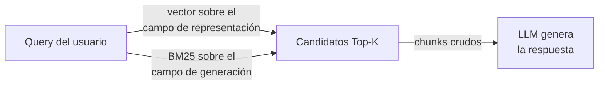

# Capítulo 12: La estrategia del doble campo (Summary-Indexed Retrieval / Small-to-Big)

## Dos trabajos, un texto

La intuición por defecto — en tutoriales, en frameworks, en la mayoría de sistemas montados — es embeber el chunk tal cual: el texto entra al modelo de embeddings y sale un vector, y ese vector sirve tanto para encontrar el chunk como para entregarlo. Un texto, dos trabajos.

El problema es qué hay en ese texto. Un chunk real de un corpus empresarial es denso en **cifras, símbolos, estructuras tabulares y nombres técnicos** — y el modelo de embeddings, que entiende de significado, se encuentra con material que no tiene significado conversacional. Un embedding de texto tabular o denso en números es un vector **promediado y confuso**: la tabla salarial, con sus doscientas celdas numéricas, produce un punto en el espacio vectorial que no se parece a ninguna pregunta natural. El usuario pregunta "¿cuánto cobra un oficial de primera?"; el vector del chunk responde con la entropía de una tabla.

La solución de fondo no es un modelo de embeddings mejor — los hay mejores, y seguirán fallando en esto, porque el problema no es de capacidad sino de **material**: no hay forma de que doscientas celdas numéricas se parezcan a una frase. La solución es estructural: **no embeber la misma cosa que se entrega**. Separar el texto que se indexa del texto que se envía.

## Los dos campos

Cada chunk Silver llega al Rack con dos campos de texto con propósitos radicalmente distintos:

| Campo | Contenido | Quién lo consume | Para qué |
|---|---|---|---|
| **Campo de representación** | Resumen del documento (las 3 líneas de cabecera) + descripción de lo que contiene esta pieza concreta | El modelo de embeddings (Qwen3-Embedding-8B) | Ser **encontrado** |
| **Campo de generación** | El chunk completo en Markdown (breadcrumb + contenido, tablas incluidas) | El LLM en producción | Ser **usado** |

Para la tabla salarial del capítulo 11:

- *Campo de representación*: "Tabla salarial del Convenio del sector X para 2025. Sueldos base mensuales por categoría profesional (auxiliar, oficial de segunda, oficial de primera). Vigente desde enero de 2025, con revisión semestral."
- *Campo de generación*: la tabla Markdown íntegra, con su breadcrumb.

El usuario pregunta "sueldo de oficial de primera 2025"; la pregunta se parece al campo de representación — lenguaje natural, conceptual, con los términos exactos — se encuentra el chunk, y al LLM se le entrega la tabla exacta, entera, con sus encabezados y sus notas. Cada campo hace el trabajo para el que es bueno: el resumen, que sabe de palabras; la tabla, que sabe de cifras.

La búsqueda, con los dos campos en marcha:

Fíjate en que el patrón ya estaba sembrado por el método: las tres líneas de resumen en cabecera (cap. 10) y la descripción obligatoria de las tablas (cap. 11) no eran cosmética — eran este capítulo esperando su turno. El doble campo no añade trabajo: **le da su destino natural al trabajo ya hecho**.

## El patrón: small-to-big

Esta arquitectura tiene nombre propio en la industria: **small-to-big retrieval** (también *parent-document retrieval*). Se indexa pequeño — un resumen compacto, semánticamente denso — y se entrega grande — el chunk completo con todo el detalle. La simetría con el capítulo 10 es exacta y conviene verbalizarla: el chunk grande era defendible *porque* este capítulo existiría. El resumen absorbe la dilución semántica del chunk grande (es él, no el bloque entero, el que se convierte en vector); el chunk grande devuelve la completitud que el resumen no puede dar (el modelo recibe la píldora entera, no su silueta).

Lo que **no** debe hacerse — y es la tentación del pragmatismo: embeber ambos (resumen y chunk) como vectores separados del mismo chunk. Produce duplicidad de recuperación — el mismo documento entra dos veces en cada Top-K, robando puestos — y desorden de ranking: dos vectores hermanos compitiendo entre sí. La regla es limpia: **un chunk, un vector — el del campo de representación.**

## El límite del resumen puro (y la búsqueda híbrida)

Honestidad de manual: el resumen tiene un punto ciego. Es lenguaje natural conceptual, y hay búsquedas que son **literales**: nombres propios, siglas, referencias normativas exactas — "Orden ESS/1457/2018", "artículo 14.3", "anexo IV" — o términos técnicos que el resumen no recogió. El vector del resumen puede no estar a la altura de esas consultas: no hay "ESS/1457" en ninguna descripción bien escrita, porque las descripciones bien escritas no van llenas de siglas.

Quien cubre ese terreno es la **búsqueda léxica clásica** (BM25), que busca coincidencia de términos exactos sobre el texto completo — y para la que el chunk crudo, con todas sus siglas y referencias, es el material ideal. Por eso el método recomienda completar la arquitectura con **búsqueda híbrida**: BM25 sobre el campo de generación + vectorial sobre el campo de representación, con fusión de rankings — el estándar es **RRF**, *Reciprocal Rank Fusion*, que combina listas ordenadas sin tener que comparar puntuaciones de naturaleza distinta.

La división del trabajo queda quirúrgica:

- El **vector** aporta la semántica: "condiciones económicas del puesto" encuentra la tabla salarial aunque no comparta ninguna palabra literal.
- El **léxico** aporta el literal: "ESS/1457/2018" encuentra el documento exacto aunque su resumen hable en generalidades.
- La **fusión** decide quiénes suben: los que ambos mundos señalan son casi siempre la respuesta.

Ninguno basta solo — el vector falla con los literales, el léxico falla con los sinónimos — y la fusión de los dos es uno de los pocos "gratis" honestos de esta industria. Esta decisión se toma aquí y se documenta como parte del **contrato del Rack**: el consumidor (el sistema RAG) debe saber que el Rack está diseñado para consultarse de las dos maneras, y que el rerank y los boosts que aplique después (los Gold del capítulo 15, por ejemplo) operan sobre el resultado fusionado.

## La normalización del idioma: una puerta de búsqueda en un solo idioma

Muchos corpus son multilingües sin que nadie lo haya decidido: normativa europea en inglés, convenios en español, políticas corporativas en el idioma de la matriz. ¿Tiene esa mezcla que penalizar la recuperación? No — si el idioma del campo de búsqueda se trata como lo que es: una decisión de diseño que se hereda del scoping.

El principio cabe en dos líneas y separa lo que se puede tocar de lo que no:

> **El campo de generación reproduce siempre el origen — falsearlo no está en el menú. El campo de representación es de uso interno del retrieval — y ese sí se ajusta.**

El campo de representación existe para que las preguntas encuentren piezas; es infraestructura de búsqueda, no contenido. Por eso se puede **normalizar a un único idioma** — el idioma objetivo del dominio, fijado en su ficha (cap. 2: idioma de consulta) — traduciendo las descripciones de los documentos que no estén en él. El crudo que llega al LLM sigue siendo el original: la verdad no se traduce; se traduce la puerta.

Y con la puerta normalizada, el flujo completo se cierra en cuatro pasos, en este orden:

1. El usuario pregunta **en el idioma que quiera**.
2. El orquestador **traduce la query al idioma en que están los vectores**.
3. La recuperación ocurre en ese idioma normalizado — vectorial y, si se usa, léxico sobre el campo de búsqueda.
4. El LLM **responde al usuario en su idioma**, citando los chunks crudo originales.

### En qué beneficia, y a qué coste

**Beneficios**: elimina el *gap* cross-lingual — todo matching ocurre en igualdad de idioma; unifica la superficie de búsqueda (vectorial y léxico sobre el mismo campo, en el mismo idioma); homogeneiza la terminología que alimentan las descripciones (etiquetado, sondas, dataset áureo).

**El coste/beneficio se estudia por proyecto** — este paso no es obligatorio, es condicional. Si el corpus ya está en el idioma de los usuarios, **el paso se omite y su coste es cero**. Si es multilingüe, se traducen descripciones de tres líneas — una fracción mínima del coste de traducir documentos — y solo de los documentos fuera del idioma objetivo. Y las garantías del método lo hacen barato de mantener: idempotente (una traducción por versión de documento; las re-ingestas sin cambio de hash no re-traducen), y el modelo de traducción registrado en el manifiesto como parte del contrato — cambiarlo dispara el patrón A→B del capítulo 18, exactamente como un cambio de embedder.

**Los riesgos, reajustados a su tamaño real**: un error de traducción en una descripción degrada levemente la recuperabilidad de un chunk — jamás la verdad, porque el original sigue llegando al LLM. Y el LLM generador apenas se inmuta: recibe originales y responde en el idioma del usuario; citar la expresión original es más virtud que defecto.

| Situación del corpus | Decisión |
|---|---|
| Monolingüe, en el idioma de los usuarios | **Paso omitido** — coste cero |
| Multilingüe, usuarios en un idioma dominante | **Paso aplicado** — descripciones traducidas al idioma objetivo; originales intactos |
| Multilingüe, usuarios multilingües | Punto de diseño abierto: exige decisión consciente (tensiona el "un chunk, un vector") |

## El contrato de los campos

Todo chunk Silver entregado al Rack respeta este contrato:

- Tiene exactamente **un vector**: el del campo de representación.
- El campo de representación siempre incluye: **resumen del documento origen + descripción de la pieza**. En chunks de texto, la descripción dice de qué trata y qué pregunta responde; en tablas, la del capítulo 11.
- El campo de representación se redacta en el **idioma objetivo del dominio** (cap. 2): la puerta de búsqueda en un solo idioma, el contenido en el suyo — la normalización de la sección anterior.
- El campo de generación es **independiente e íntegro**: nunca se recorta para "ayudar" al embedding, porque no lo consume. Su pureza es la pureza de lo que llegará al LLM.
- Ambos campos actualizan el manifiesto junto al resto de metadatos (`num_chunk`, dominio, labels), y el modelo de embeddings que generó el vector queda registrado (será crítico en el capítulo 18).

Y una consecuencia de gobierno que conviene anotar: cambiar la **estrategia de descripción** — cómo se escriben los campos de representación — es cambiar la recuperabilidad de todo el Rack, y por tanto es un cambio que se valida con la suite del capítulo 17 antes de desplegarse, como cualquier modificación estructural. Las descripciones no son textos decorativos: son la fachada del Rack ante la búsqueda.

## Errores frecuentes con el doble campo

**El campo de representación generado sin criterio.** Delegar en un LLM la descripción de cada chunk sin supervisión ni plantilla produce descripciones inconsistentes: unas muy cortas, otras alargadas, algunas inventando contenido. La descripción se redacta con plantilla (qué contiene, qué pregunta responde, qué documento ancla) y con muestreo de control, como todo lo que toca metadatos.

**Duplicar el vector.** Ya dicho, se repite porque aparece siempre: embeber resumen *y* chunk como dos vectores. El Top-K se llena de gemelos y el rerank hereda un empate artificial.

**Recortar el campo de generación "para ahorrar contexto".** El chunk crudo se va recortando sobre la marcha hasta que la tabla llega al modelo con las últimas filas fuera. El campo de generación es sagrado: si su tamaño es un problema, el problema es del chunking (cap. 10), y se resuelve ahí — no mutilando la entrega.

**Olvidar registrar el modelo de embeddings.** El vector en el índice y ningún registro de qué modelo lo produjo. Funciona hasta la migración del capítulo 18, cuando alguien tenga que reconstruir qué chunks se embeberon con qué versión — con la mitad de los vectores sin procedencia. El modelo es un metadato obligatorio desde el primer vector.

!!! quote "Regla del capítulo"
    lo que se embebe sirve para ser encontrado; lo que se entrega sirve para ser entendido. Cuando son el mismo texto, uno de los dos trabajos se hace mal. Casi siempre el primero.

