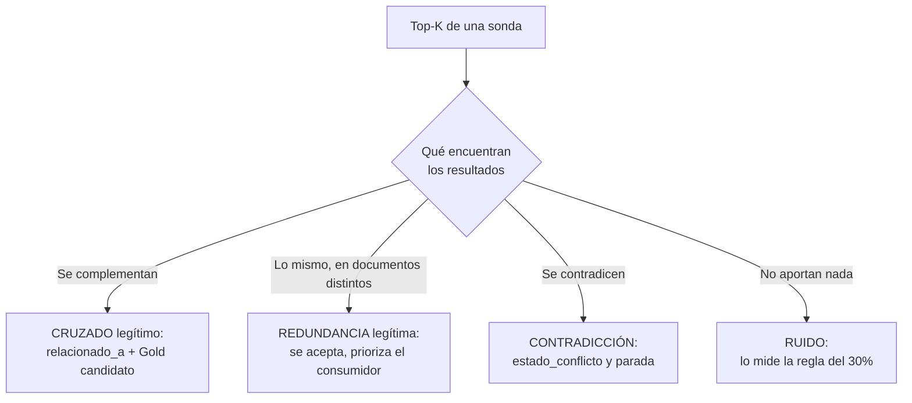

# Capítulo 13: Auditoría de coherencia del Silver (Probe Queries & Conflict Detection)

## La primera conversación real

Con el Silver troceado e ingerido llega un momento que todo proyecto vive igual: la primera conversación honesta con el sistema. No la demo — la conversación real, las preguntas que la gente de verdad quiere hacer. Y en esa conversación aparecen, con puntualidad alemana, dos fenómenos que viven en todo corpus por cuidado que esté: la **información cruzada** — el mismo tema repartido entre documentos y dominios distintos — y las **contradicciones** — documentos que afirman cosas incompatibles sobre el mismo hecho.

Ninguno de los dos es un fallo del pipeline. El cruzado es *estructura por descubrir*: la realidad de la organización es transversal y el corpus la refleja. La contradicción es *historia mal gestionada*: versiones que convivieron, fuentes desincronizadas, normas derogadas sin marca. Ambos son normales. Lo que no es normal — lo que separa los sistemas que funcionan de las leyendas de terror — es **no saber que están ahí**.

Este capítulo es el método para saberlo: la **auditoría de coherencia**, el examen del Silver antes de producir sobre él la capa Gold. No necesita LLM ni sistema en producción: son **queries sonda** — consultas típicas del negocio lanzadas directamente contra la búsqueda del Rack, revisando qué devuelve el Top-K (10 resultados es un buen estándar).

## El protocolo

1. **Preparar 20–50 queries sonda** del dominio, tomadas de la ficha del capítulo 2: las preguntas que motivaron todo el proyecto. "¿Cómo se calcula el IRPF para autónomos?", "¿Cuántos días de asuntos propios?", "¿Cuál es el salario base de un oficial de primera en 2025?" Si la ficha de dominio se hizo bien, la lista de sondas ya está medio escrita.
2. **Ejecutar cada sonda** contra el índice y registrar el Top-K: qué chunks vuelven, de qué documentos, de qué dominios, con qué vigencia y qué confidencialidad.
3. **Revisar manualmente** cada resultado contra dos preguntas: ¿es legítimo que esto aparezca junto? ¿están diciendo lo mismo o cosas incompatibles?
4. **Registrar el diagnóstico** por cada sonda: limpia, cruzada, contradictoria — con los documentos implicados.

La revisión es manual y así debe ser durante mucho tiempo. El objetivo no es automatizar la auditoría — los detectores automáticos de contradicciones existen y algún día ayudarán — es que el equipo **sepa lo que hay**. Un auditor que ha leído cincuenta sondas del corpus conoce el corpus mejor que cualquier métrica: sabe dónde vive cada tema, qué dominios se cruzan y qué fuentes tienen mala leche. Ese conocimiento informal es el activo más valioso de las fases siguientes.

## Cómo se construyen las sondas: cuatro patrones

Las sondas no se improvisan; siguen patrones que cubren los modos de fallo del Rack. Cuatro familias, y conviene tener representadas las cuatro:

- **Sondas de hecho** ("¿Cuántos días de asuntos propios?"): verifican que los hechos atómicos — Silver tabular y normativo — se recuperan. Son las que detectan el *enterrado*.
- **Sondas de concepto cruzado** ("¿Cómo afecta el SMI a las nóminas?"): preguntan por conceptos que viven en varios dominios a propósito. Son las que llenan el `relacionado_a` y alimentan la lista de futuros Gold.
- **Sondas de vigencia** ("¿Cuál es la política de teletrabajo?"): se hacen sin especificar año, a propósito, para ver qué versión devuelve el sistema. Son las que cazan el modo fantasma.
- **Sondas numéricas** ("¿Cuál es el salario base de un oficial de primera en 2025?"): apuntan a tablas. Son las más frágiles — el embedding de cifras es el punto débil conocido — y por eso las más valiosas de auditar antes de que lo haga un usuario.

La proporción recomendada replica la realidad esperable de uso: mayoría de sondas de hecho, y suficientes de las otras tres familias como para conocer el terreno. Veinte sondas bien repartidas enseñan más que cincuenta agrupadas en una familia.

## La anatomía de una sonda, por dentro

Vale la pena ver una sonda completa, con su Top-K examinado, porque el oficio de la auditoría está en esa lectura. Sonda: *"¿Cómo se calcula el IRPF para autónomos?"*

| Puesto | Chunk devuelto | Dominio | Diagnóstico |
|---|---|---|---|
| 1 | Artículo de la ley vigente | Legal | OK — pero dice 21% |
| 2 | Borrador de enero (nunca promulgado) | Legal | **Contradice al 1**: dice 19% |
| 3 | Tabla de cuotas prácticas | Finanzas | OK — cruzado legítimo |
| 4 | FAQ de otra norma, tangencial | RRHH | Ruido recuperado |
| 5 | Definición de retención | Legal | OK |
| 6–10 | Fragmentos marginales | varios | Ruido menor |

Esa única sonda — dos minutos de lectura — ha destapado una contradicción (puestos 1-2), un cruce legítimo que merece Gold (1+3) y ruido a depurar (4). Multiplicad por cincuenta sondas y se entiende por qué ningún reporte automático sustituye a la primera lectura humana del corpus.

## Información cruzada legítima: `relacionado_a`

El primer hallazgo habitual: para un mismo tema vuelven chunks de dominios distintos. La sonda "IRPF" devuelve artículos de Legal **y** tablas de aplicación de Finanzas — y quizá una nota de RRHH sobre retenciones en nómina. Instinto equivocado: "el buscador se ha confundido". Realidad: **eso no es un problema — es estructura por descubrir.** El mismo concepto vive legítimamente en varios dominios, disperso entre normas y aplicaciones.

La acción es etiquetar esa estructura para que el sistema la conozca: los documentos involucrados reciben en el manifiesto el campo `relacionado_a` con los conceptos y vecinos detectados ("IRPF" → legal, finanzas, rrhh). El registro tiene tres consumidores: las futuras sondas (el auditor ya sabe dónde mirar), las facetas (si el cruce es sistemático, quizá la clasificación necesita un ajuste) y la capa Gold (cap. 14), que convierte la dispersión detectada en síntesis explícita.

Un criterio de calibración: el cruzado es legítimo cuando las piezas son **complementarias** — cada una aporta algo que las otras no tienen. Si al revisar el Top-K los resultados de distintos dominios **repiten** el mismo contenido (la copia de correo que duplica el boletín), no es cruzado: es duplicado que la fase de alcance o el curado dejaron pasar, y se remonta aguas arriba.

## La redundancia no es ruido: la tercera categoría

Entre el cruce legítimo y la contradicción hay una tercera categoría que la auditoría encuentra constantemente y que conviene nombrar, porque el instinto equivocado es purgarla: la **redundancia legítima**. Dos documentos distintos — con distinta autoría, distinto propósito y distinta redacción — que tratan el mismo punto y dicen lo mismo.

El instinto de ingeniero dice: *"esto está dos veces; quito uno y dejo un solo chunk para esa información"*. Es lo más aséptico, y es un error. Porque la redundancia entre documentos legítimos **no es basura duplicada: es resiliencia**. Si esa información vive en un solo chunk y mañana su documento se sustituye o se da de baja, la información muere con él — el sistema pierde algo que otros documentos seguían diciendo. Si vive en los dos, la baja de uno deja el otro intacto: el sistema se degrada, no se rompe. La purga aséptica fabrica puntos únicos de fallo.

Reglas para las tres formas de "lo mismo":

| Forma | Qué es | Qué se hace |
|---|---|---|
| **Copia** | El mismo contenido, byte a byte o casi: la retransmisión de un boletín, el PDF duplicado | Se deduplica en captura por hash (cap. 5) y se remonta aguas arriba |
| **Redundancia legítima** | La misma información en dos documentos distintos y legítimos, con redacción distinta | **Se acepta.** No se purga; se etiqueta (`relacionado_a`) y el consumidor prioriza |
| **Contradicción** | Informaciones incompatibles sobre el mismo hecho | Se marca (`estado_conflicto`) y se para hasta resolver (cap. 14) |

El árbol de decisión de la auditoría, en un vistazo:

Y la frontera con el ruido, que responde a la pregunta del Top-K: los chunks redundantes **puntúan alto** — son relevantes, así que la regla del 30% del cap. 17 no los cuenta como ruido. El ruido es lo que puntúa bajo; la redundancia es lo que puntúa alto repetido. La primera se filtra; la segunda se gestiona con priorización: **rerank, dominios o labels — decisión del consumidor, como siempre.** El coste existe (tokens, índice — cap. 21) y se paga a conciencia: es la prima del seguro de vida de la información.

## Contradicciones: `estado_conflicto`

El segundo hallazgo es el grave: dos chunks que **afirman cosas incompatibles sobre el mismo hecho**. Un documento dice que el tipo aplicable es el 19%; otro, que el 21%. Ambos provenientes de fuentes legítimas, ambos `vigentes` en apariencia, ambos servidos en el mismo Top-K.

Las causas típicas, por orden de frecuencia en corpus reales:

- **Versiones en vigencia simultánea**: una norma derogada o sustituida que conserva la etiqueta `vigente` — el 19% del borrador de enero que nunca se promulgó, dormido con etiqueta de vivo. Es, con diferencia, la causa reina, y casi siempre remite a un fallo de la fase de clasificación (cap. 9).
- **Documentos paralelos desincronizados**: la política actualizada nunca sustituyó a la antigua — se publicó la nueva, nadie retiró (ni marcó) la previa, y ambas conviven con apariencia de verdad.
- **Errores de curado o OCR** que alteraron un dato: el 21% leído como 19% por un escaneado de mala calidad. La auditoría los destapa porque el conflicto salta a la vista — y la solución está en el capítulo 6 o 7, no en el 14.

La acción es marcar, sin ambigüedad, en el manifiesto:

- `estado_conflicto = true` en los chunks involucrados.
- `contradice_a = [doc_id]` apuntándose mutuamente.
- En la nota: qué afirmación hace cada uno, y la causa sospechada.

Lo que **no** se hace en esta fase: resolver. La auditoría diagnostica y marca; la reparación es el capítulo 14. La separación importa — resolver un conflicto exige autoridad y conocimiento del dominio, y hacerse sobre la marcha, dentro de la auditoría, produce verdades improvisadas.

## El criterio de parada

Y aquí la regla más dura del método: **si más del 5% de las sondas revelan contradicciones graves — mismo concepto, datos incompatibles — el pipeline se detiene.**

No se sintetiza Gold sobre un Silver conflictivo, porque el Gold heredaría y perpetuaría el conflicto en lugar de resolverlo: la síntesis nacería eligiendo entre dos verdades sin haber saneado el terreno. Se vuelve a las fases de origen — vigencias mal asignadas (cap. 9), curado (cap. 7), fuentes desincronizadas (cap. 3) — y se re-audita tras la corrección.

El 5% no es arbitrariedad estadística: es una declaración de filosofía. Si de cincuenta preguntas, tres destapan contradicciones, el problema puede ser puntual; si destapan diez, el Silver entero está en duda, y construir Gold encima es construir sobre suelo que se mueve. La parada duele — los plazos duelen siempre — y es exactamente el tipo de dolor que este libro defiende: el de ahora, barato y consciente, frente al de producción, caro y delante de todos.

## Por qué manual — y cuándo dejará de serlo

La revisión manual tiene dos ventajas que ninguna automatización ofrece hoy. Primera: **entiende el matiz** — distinguir una contradicción real de un matiz legítimo ("el tipo estatal" frente a "el tipo total") exige conocimiento del dominio, no similitud semántica. Segunda: **fabrica conocimiento organizativo** — el auditor que ha leído el corpus sonda a sonda es la persona más útil del proyecto durante los doce meses siguientes.

¿Cuándo automatizar? Cuando el corpus es demasiado grande para leerse y la auditoría se convierte en rutina recurrente (cada ciclo de frescura del cap. 20), tiene sentido un detector LLM de sospechas de contradicción que **prioriza** qué revisar. Nota la dirección correcta: la máquina propone sospechas; el humano confirma conflictos. Nunca al revés — marcar contradicciones automáticas sin verificación humana fabrica el conflicto de una vez por cada falso positivo.

## Qué NO es esta fase

- **No es evaluación del RAG**: no hay LLM respondiendo, no hay prompts, no hay usuarios finales. Es integridad del índice — que la búsqueda devuelva lo que debe existir y que no existan contradicciones entre lo que existe. La evaluación de extremo a extremo queda, deliberadamente, fuera del ámbito de este libro.
- **No es una fase opcional**: un Rack sin auditar es un Rack con fechas de caducidad ocultas. Las contradicciones no avisan; salen en producción, en la respuesta de un asistente, delante del comité de empresa.
- **No arregla nada**: y eso es una virtud. El que diagnostica no debe ser el que repara — le evita el incentivo de "arreglar rápido" y le permite marcar con total libertad.

## El registro de la auditoría

Cada sonda deja fila en un registro propio (el manifiesto no basta para esto — es una vista por documento, y la auditoría es por concepto): query, fecha, Top-K devuelto, diagnóstico, documentos marcados, conclusiones. Ese registro es la línea base sobre la que el capítulo 17 construye la suite formal de validación — de hecho, **las mejores queries del dataset áureo salen de aquí**: son las que ya conoces a fondo, con su respuesta esperada sabida y sus casos vividos. La auditoría es, también, la primera redacción del examen que el Rack tendrá que aprobar.

!!! quote "Regla del capítulo"
    las contradicciones no se arreglan solas ni se esconden: se marcan, se cuentan y se paran las máquinas hasta entenderlas. El 5% de parada no es burocracia — es la diferencia entre sintetizar conocimiento y sintetizar el caos.

