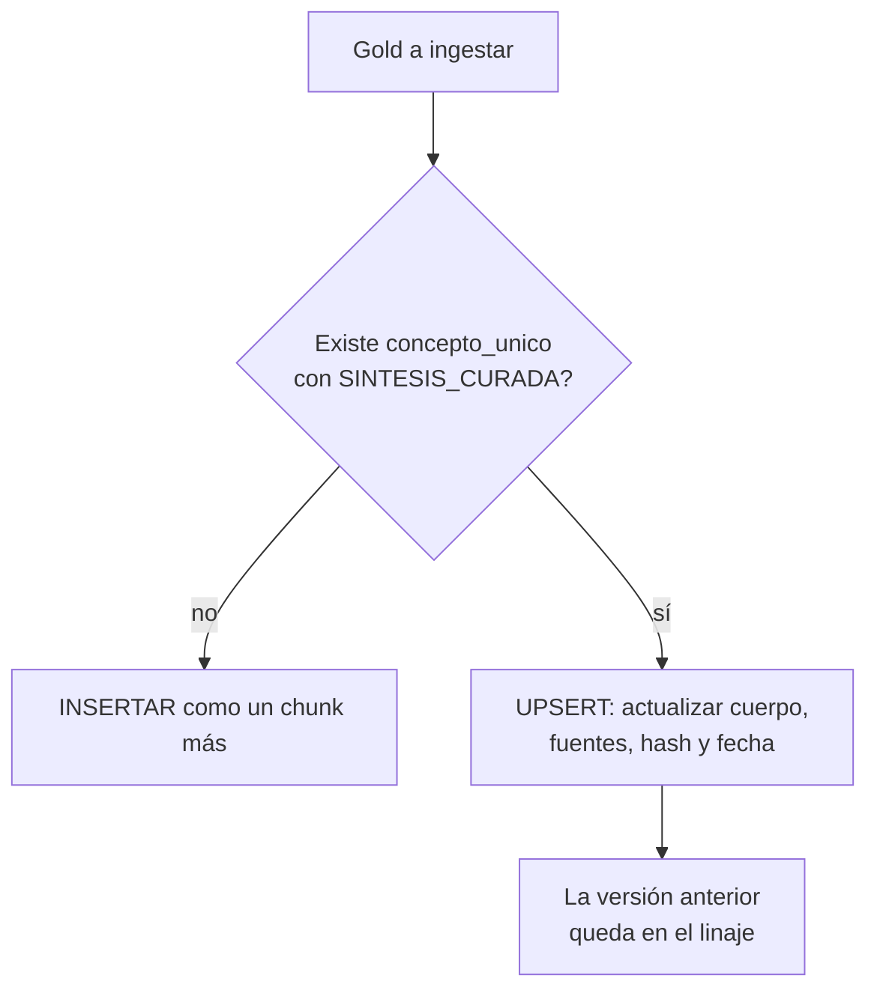

# Capítulo 15: Ingesta del Gold (Unicidad y marcaje)

## Un chunk más en el mismo océano

Primera decisión de arquitectura de este capítulo — tomada ya en la conversación que originó este libro, y defendida aquí con argumentos, porque es de las que generan debate: **los documentos Gold viven en el mismo índice que el Silver**. No hay tabla aparte, no hay colección especial, no hay índice paralelo de "verdades certificadas".

La razón central: **la búsqueda es una sola, y no puede saber a priori si la mejor respuesta es un hecho o una síntesis.** Cuando una pregunta llega al Rack, la búsqueda vectorial encuentra los vecinos más parecidos a la pregunta; si los Gold vivieran aparte, habría que decidir de antemano — en cada pregunta, para siempre — si se consulta la vitrina o el archivo, o en qué orden mezclarlos. Preguntas mal enrutadas, dos índices que sincronizar, dos formas de romperse. Con todo en el mismo espacio, compiten en igualdad y el mejor contenido gana: en "¿cómo se calcula el IRPF?", la síntesis *debe* poder ganarle al artículo de la ley por derecho propio — no por vivir en una vitrina privilegiada.

A esto se suma el mantenimiento: un solo esquema, un solo pipeline de actualización, una sola forma de equivocarse en lugar de dos. Y una razón estructural: **el Gold necesita a los Silver vecinos** — su valor es señalar a las fuentes, y separarlos espacialmente rompe la naturalidad de esa relación y convierte el enlace `doc_id` en una referencia entre mundos.

Las alternativas rechazadas, por si alguien las propone en una reunión: la *tabla aparte de Golds* obliga a buscar siempre en dos sitios y a inventar una política de fusión; el *índice espejo* (mismo contenido, dos colecciones) duplica el mantenimiento y diverge a la primera prisa; la *tabla relacional externa al índice* rompe la búsqueda semántica de los propios Golds, que también deben ser encontrables. Todas resuelven un problema de gobierno fabricando tres de arquitectura.

El Gold es, simplemente, **un chunk más del océano — con chaleco salvavidas**. El chaleco son sus metadatos.

## Dónde vive el archivo Gold: dos variantes legítimas de repositorio

La regla de este capítulo habla del **índice**: el Gold vive en el mismo espacio vectorial que el Silver, marcado con su label. Pero queda una decisión de nivel inferior que el método no impone: **dónde vive el archivo .md del Gold en el repositorio del corpus** (cap. 20). Hay dos variantes legítimas — las organizaciones reales usan las dos — y conviene conocerlas porque piden cuidados distintos:

- **Variante A — colocado junto a sus fuentes.** El Gold vive en la carpeta del concepto que unifica, junto al master y al curado (así aparece en el árbol del cap. 20). Ventaja: el contexto manda — abrir la carpeta de un tema muestra todo lo que existe sobre él, verdad incluida.
- **Variante B — carpeta-capa Gold.** Todos los Gold viven juntos en una carpeta de primer nivel — `documentos-curados/` en la implementación real de este método — como catálogo centralizado de las verdades. Ventaja: **el catálogo es gratis** — "¿cuántas verdades declaradas existen y cuáles son?" es un `ls`; la auditoría de duplicados del cap. 14 se vuelve trivial, y los curadores saben dónde viven las síntesis sin navegar dominios.

Las dos son correctas **si se cumplen las mismas dos condiciones**, que son lo único que importa de verdad:

1. **La ruta da el contenedor; la cabecera da la identidad.** En la variante B, la carpeta de primer nivel es una **capa, no un dominio semántico**. Si la ingesta derivara el dominio de la ruta, el Gold entraría con un dominio llamado "documentos-curados" y desaparecería de los resultados filtrados por los dominios reales que unifica — justo cuando el consumidor filtra por convenios, la verdad sobre convenios se esconde. Por eso los Gold de la carpeta-capa llevan en su cabecera (front-matter) los **dominios y labels reales** que cubren, y la ingesta los honra por encima de la ruta.
2. **La marca viaja igual en ambas**: `SINTESIS_CURADA` en labels, `concepto_unico` para el UPSERT y `fuentes_enlazadas` para la trazabilidad — en la cabecera del .md (variante B) o en el manifiesto (variante A).

Lo que **no** cambia entre variantes: ni el índice (mismo espacio, nunca una colección aparte), ni la unicidad (un concepto, un Gold), ni la autoría firmada. La carpeta es organización de repositorio; el contrato del Gold es el mismo. Y si se elige la variante B, hay que declararla en el índice de dominios como lo que es — una capa — para que nadie la trate como un dominio más ni la llene de documentos que no son síntesis.

## La marca: una label, no un campo especial

A estas alturas del método, el esquema ya tiene todo lo necesario. El Gold no necesita campos ad hoc — ni `tipo_documento`, ni `prioridad_rerank`, ni columnas de gobierno: necesita **una label más** en el campo `labels` que ya usa todo el Silver:

```
labels: ["2025", "legislacion", "SINTESIS_CURADA"]
```

¿Por qué una label y no un campo dedicado? Porque el principio es el mismo que rige las facetas del capítulo 9: **los metadatos describen; el consumidor decide**. La base de datos guarda strings; es el sistema que consulta el Rack el que lee `"SINTESIS_CURADA"` y aplica la política que toque — dar más peso en el rerank, filtrar para mostrar solo síntesis, o marcar visualmente la respuesta como "autorizada". La BBDD no tiene opinión sobre relevancia; expone la llave para que la política de relevancia sea posible.

Esta separación — *la física del dato en la BBDD, la política de relevancia en el consumidor* — es la razón por la que el índice no necesita saber nada de reranks ni boosts, y por la que este libro, que termina en la puerta del Rack, puede dejar la marca puesta sin invadir el terreno del RAG. Si mañana la política cambia — "los Gold ya no llevan boost, se muestran en panel aparte" — el índice no se toca: cambia la lectura que el consumidor hace de la label.

## Los campos que sí son exclusivos del Gold

Además de la label, el registro Gold lleva rellenos los campos que en el Silver son nulos:

| Campo | En el Silver | En el Gold |
|---|---|---|
| `labels` | Sus facetas | Sus facetas **+** `SINTESIS_CURADA` |
| `concepto_unico` | `null` | La clave del concepto ("IRPF_autonomos_calculo_2025") |
| `resuelve_conflictos` | `null` | Array de `doc_id` que unifica o descarta |
| `fuentes_enlazadas` | `null` | Array de `doc_id` que lo sustentan |
| `num_chunk` | "3/12" | "1/1" (el Gold es atómico; no se trocea) |
| `hash_sha256` | Hash del original | Hash del propio texto de la síntesis (clave anti-duplicado) |

Tres observaciones sobre la tabla. El **Gold es multi-dominio por naturaleza** ("Legal + Finanzas" en el ejemplo del IRPF): es de las pocas criaturas del método a las que conviene permitir el array de dominios, y por eso la decisión del capítulo 2 debe haberlo previsto. Su **`num_chunk` es 1/1**: no se trocea — un Gold partido en chunks pierde su razón de ser, que es ser la explicación entera y coherente. Y su **hash es del propio texto de la síntesis**: es la segunda barrera anti-duplicado — si alguien ingesta por error dos síntesis gemelas con distinto `concepto_unico` pero texto idéntico, el hash las delata.

## El registro completo, por dentro

Así queda, de principio a fin, el registro del Gold del IRPF:

```
id_registro:        7f3c... (UUID)
tipo:               Gold — síntesis del concepto IRPF_autonomos_calculo_2025
dominio:            ["legal", "finanzas"]
labels:             ["2025", "legislacion", "SINTESIS_CURADA"]
concepto_unico:     "IRPF_autonomos_calculo_2025"
resuelve_conflictos: [doc_borrador_19, doc_ley_21]
fuentes_enlazadas:  [doc_ley_21, doc_tabla_cuotas]
num_chunk:          1/1
hash_sha256:        (del texto de la síntesis)
fecha_ingesta:      2025-11-03 — UPSERT (2ª versión)
autor:              [experto del dominio] — validada y firmada

campo_busqueda_semantica:
  "Documento oficial que unifica el criterio del IRPF 2025 para
   autónomos: aplica el 21% según la ley vigente, descarta el
   borrador del 19% y remite a la tabla de cuotas de Finanzas."
   → ESE texto es el que está embebido (un vector, el suyo).

texto_chunk_crudo:
  El cuerpo completo de la síntesis, con sus enlaces [Doc A],
  [Doc C] y el descarte declarado de [Doc B].
```

Fíjense en las dos texturas del documento: en el campo de búsqueda vive la declaración limpia — lo que la síntesis unifica — y en el campo de generación el cuerpo entero con sus fuentes. Preguntas conceptuales encuentran el primero; el modelo recibe el segundo. El doble campo del capítulo 12, cumpliéndose en el registro más delicado del Rack. (En la implementación sobre repositorio del cap. 20, los metadatos de gobierno — `concepto_unico`, `resuelve_conflictos`, `fuentes_enlazadas`, autor — viajan en la cabecera del propio .md del Gold: con el texto, en la misma rama, en el mismo commit.)

## El UPSERT: la unicidad hecha proceso

La regla del capítulo 14 — *un concepto, un Gold* — se garantiza en la ingesta con la lógica de **UPSERT** (actualizar o insertar):

1. **Antes de insertar**, consultar si ya existe un registro con esa `concepto_unico` y la label `SINTESIS_CURADA`.
2. **Si existe**: no se crea nada nuevo. Se **actualiza** el registro existente — cuerpo, campo de representación, fuentes, `resuelve_conflictos`, hash y fecha — y la versión anterior queda en el linaje del manifiesto.
3. **Si no existe**: se inserta como cualquier chunk, con sus campos especiales rellenos.


El UPSERT, en diagrama:



El resultado: ejecutar la ingesta de la misma síntesis cien veces deja el Rack en el mismo estado que ejecutarla una. La idempotencia documental del capítulo 1, aplicada a la verdad. Y la referencia cruzada completa: en el ejemplo del IRPF, el Gold declara `resuelve_conflictos = [doc 19%, doc 21%]` — de modo que el consumidor que quiera "solo verdad vigente" puede descartar automáticamente los contradictorios originales cuando existe una síntesis que los resuelve. Esa decisión es también del consumidor; el Rack solo garantiza que la información para tomarla está donde debe.

## La regla del "solo uno" y su auditoría

El UPSERT garantiza la unicidad *en la ingesta*. Con el tiempo, conviene auditarla *en el índice*: comprobar periódicamente que no existen dos registros con `SINTESIS_CURADA` y la misma `concepto_unico`. Si aparecen — una ingesta manual a las seis de la tarde de un viernes, un script fuera de proceso — la política es clara: **se conserva el más reciente, se marca el otro como `deprecado` y se documenta** en el manifiesto. La regla no admite la coexistencia educada de dos síntesis gemelas: dos Gold explicando lo mismo es el síntoma temprano de que alguien está escribiendo en el Rack sin pasar por el proceso — y el problema real no son las dos síntesis, es el proceso esquivado.

La auditoría tiene además un valor formativo: cada duplicado detectado cuenta una historia — qué puerta se saltó y por qué — y esa historia mejora el proceso mejor que cualquier reglamento.

## Qué hará el consumidor con la marca

Vale la pena anticipar, sin invadir su terreno, los tres usos que el consumidor del Rack dará a la label — porque saberlos ayuda a entender por qué la marca importa tanto:

- **Boost en rerank**: los Gold suben posiciones — el usuario que pregunta por un concepto recibe primero la verdad unificada, con sus fuentes a la vista.
- **Filtro por modo de consulta**: "respóndeme solo con doctrina autorizada" es un filtro sobre `SINTESIS_CURADA`; "dame todas las fuentes crudas" es su negación. La misma label, dos productos distintos.
- **Marcado visual**: la respuesta que viene de un Gold puede presentarse como "respuesta autorizada" — con el autor y la fecha visibles — frente a la respuesta de hechos brutos.

Y un matiz de honestidad: el boost **no garantiza** que el Gold salga siempre primero — si la pregunta es por un hecho concreto ("¿cuánto cobra un auxiliar?"), lo correcto es que gane la tabla del Silver, y el boost solo empataría lo que no debe empatar. Por eso las queries del dataset áureo con Gold esperado (cap. 16) son las de concepto — y por eso la calibración del boost es política viva del consumidor, no una constante grabada en piedra. La marca garantiza que la política sea posible; su calibración fina pertenece a quien la aplica.

## Qué hereda el Gold del método completo

Vale la pena verlo junto, porque es la prueba de que el Gold no es un hack sino un ciudadano más del pipeline: tiene **manifiesto** (fila propia, con su linaje de auditoría de origen), **dominio y facetas** (cap. 9 — y su confidencialidad, obligatoria como todos), **campo de representación y de generación** (cap. 12, con su vector único), **autoría humana** — la capa es human-guided: detrás de cada Gold hay un experto del dominio que lo definió, lo escribió o lo corrigió, y el manifiesto registra quién (cap. 14) — y pasará, como todo, por la **suite de validación** de la Parte VI. El Gold no es un atajo: es el mismo método, aplicado por última vez, sobre el contenido más delicado del Rack.

!!! quote "Regla del capítulo"
    la marca del Gold es una etiqueta, su unicidad es un UPSERT y su autoridad es su trazabilidad. Nada de arquitecturas paralelas: la verdad vive donde viven los hechos, con un chaleco que dice "esto es lo que hay que creer".

