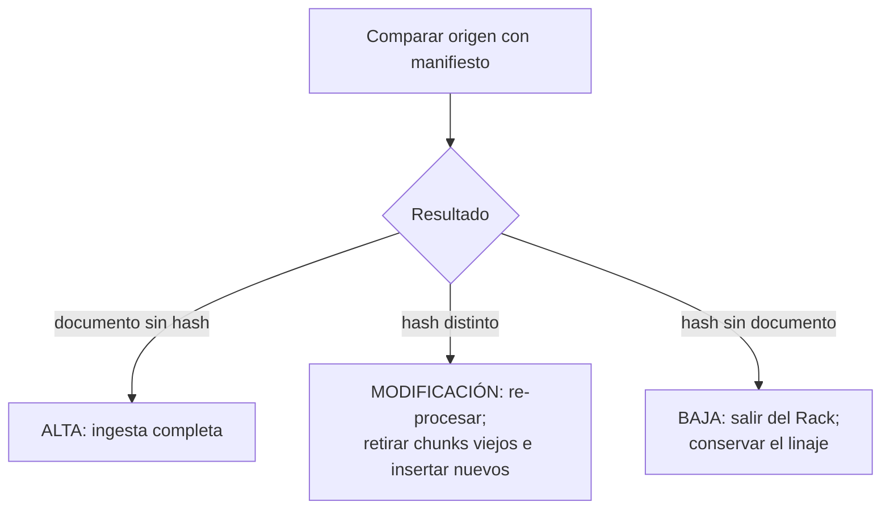
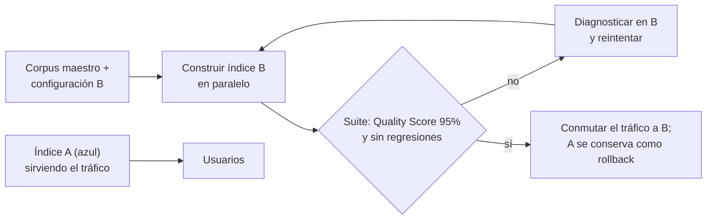

# Capítulo 18: Ciclo de vida, regresión continua y re-embedido

## El Rack no se termina: se mantiene

Todo lo anterior es la construcción. Este capítulo es la vida. Y comienza con la frase que más se subestima de los proyectos de conocimiento: **el Rack es un activo vivo** — con fuentes que cambian, conocimiento que caduca y versiones que se sustituyen.

La buena noticia del método: si las Partes I–V están bien hechas, el mantenimiento es barato — el manifiesto permite ingesta incremental, el linaje permite actualizaciones quirúrgicas, la suite permite cambiar sin miedo. La mala: si se abandona, el Rack caduca **sin dar señal alguna**. Seguirá respondiendo con la misma fluidez, la misma seguridad, la misma redacción impecable — solo que sobre el mundo de hace dos años. La caducidad silenciosa es la más traicionera de las averías, porque el sistema no parece averiado: parece un sistema, diciendo cosas antiguas.

## Ingesta incremental frente a recarga completa

Cuando las fuentes cambian — nuevas normas, políticas actualizadas, convenios revisados — hay dos estrategias:

- **Recarga completa**: re-procesar todo desde el Bronce. Simple, segura, cara. Es la elección correcta tras cambios estructurales del pipeline: nueva estrategia de chunking, nuevo modelo de embeddings, re-etiquetado masivo, nueva versión del canónico (cap. 6).
- **Ingesta incremental**: procesar solo lo nuevo o modificado, detectado comparando huellas digitales y fechas de modificación contra el manifiesto. Es la operación normal del día a día: el convenio revisado entra solo él, sus chunks se sustituyen, y el resto del Rack ni se entera.

La idempotencia documental (cap. 1) es la que hace viable la incremental: re-ingesta de lo ya conocido no duplica nada (el hash lo impide), y la actualización de un documento re-procesa sus chunks sustituyéndolos, no acumulándolos. Un pipeline incremental sobre un sistema no idempotente es una fábrica de residuos: cada pasada deja la versión vieja junto a la nueva, y el modo fantasma se fabrica en casa.

Y a medio plazo, el estándar de la industria es el **CDC** (*Change Data Capture*): las fuentes notifican sus cambios — webhooks, eventos, diffs programados — y el pipeline reacciona a la notificación en lugar de buscar cambios por sondeo. No es un requisito de arranque: la incremental programada cubre el 90% de los casos, y conviene arrancar con ella. Pero es el horizonte al que el diseño ya apunta, y por eso cada documento lleva su `fecha_modificacion_origen` desde el capítulo 5: el campo que CDC necesitará ya existe.

## Las tres operaciones de la sincronización

Comparar el origen con el manifiesto solo puede dar tres resultados, y cada uno tiene su protocolo cerrado. Esta es la forma operativa completa de la idempotencia documental:

| Operación | Detección | Acción en el pipeline | Acción en el Rack |
|---|---|---|---|
| **Alta** | Documento en origen sin hash registrado | Ingesta completa (caps. 4–12), fila nueva en el manifiesto | Sus chunks entran al índice |
| **Modificación** | Hash del original distinto del registrado | Re-procesar desde Bronce; retirar los chunks viejos — el `doc_id` los identifica como conjunto — e insertar los nuevos | Sustitución limpia: nunca conviven viejos y nuevos |
| **Baja** | Hash registrado sin documento en origen | El documento sale del Rack; su fila de manifiesto se conserva con fecha y motivo de baja | Sus chunks salen del índice |

El mismo flujo, en diagrama:

Dos matices que evitan los errores clásicos. **La baja no borra el linaje**: retirar del Rack no es arrancar la fila del manifiesto — la historia de que ese documento existió, cuándo entró y cuándo se dio de baja es parte de la trazabilidad (y a menudo, obligación legal). **La modificación no es "añadir lo nuevo"**: es sustituir el conjunto — el error de "meter los chunks del convenio actualizado sin quitar los del anterior" es, literalmente, fabricar una contradicción del capítulo 13 a mano, dentro de casa.

Con las tres operaciones cerradas, el Rack es un espejo fiel de sus fuentes: ni un chunk de más (no hay zombis de documentos muertos), ni uno de menos (no hay datos que el origen tiene y el Rack no), ni uno mezclado (no hay versiones conviviendo). **Una base de datos sana, un RAG feliz** — la idempotencia documental no es una optimización: es la definición operativa de que la base está sana.

## Un ciclo de actualización, paso a paso

Vale la pena recorrer una actualización real de principio a fin, porque cada paso compromete a un capítulo distinto del libro — y demuestra que el método entero cabe en una tarde.

**Lunes, 9:10.** La curadora del dominio `convenios` (cap. 20) recibe aviso del responsable del repositorio: se ha publicado el convenio sector 2026, que sustituye al 2025. Es el heraldo funcionando.

**9:30.** Captura del nuevo PDF al Bronce. Alta limpia: fila nueva en el manifiesto, hash propio, `doc_id_padre` no aplica (es documento nuevo, no modificación).

**10:00.** Decisión de vigencia con el experto: el convenio 2025 pasa a `deprecado`; sus hijos (tablas, articulado, anexos) heredan la marca. La **baja lógica** del 2025 queda registrada con fecha y motivo: "sustituido por convenio 2026, [doc_id]".

**10:30–14:00.** Pipeline completo sobre el nuevo convenio: normalización, curado, segmentación en sus tres hijos (tablas salariales, articulado, anexos), clasificación con las mismas reglas, auditoría automatizada de fidelidad (cap. 9): 100%, `AUDITED`.

**14:30.** Chunking e ingesta: los chunks del 2026 entran al índice. El 2025 — deprecado — **no se borra**: sigue en el Rack para preguntas históricas, fuera del filtro por defecto.

**15:00.** El experto revisa el Gold `condiciones_economicas_convenios` (cap. 14, deber de mantenimiento de la capa human-guided): la síntesis citaba tablas 2025. Actualización por UPSERT: nuevo cuerpo citando las tablas 2026, misma `concepto_unico`, fecha nueva. Ningún Gold segundo.

**15:30.** Revisión del dataset áureo: dos preguntas citaban tablas 2025 en sus esperados — se actualizan a los chunks 2026; y la pregunta "¿cuándo entra en vigor el convenio 2026?" se añade como fila nueva, con su razón.

**16:00.** Suite completa en la versión candidata: 97% de Quality Score medio, sin regresiones. Despliegue.

**16:20.** Registro final en el manifiesto: un alta, una baja lógica, cinco chunks reemplazados, un Gold actualizado, dos filas de dataset modificadas. La tarde entera, trazada.

Nótese lo que esa tarde **no** necesitó: re-procesar el resto del corpus, tocar el índice a mano, ni una sola decisión sin registro. Esa es la forma que toma "mantener al día" cuando el diseño fue idempotente.

## La gestión de la obsolescencia: `deprecado`, no borrado

El conocimiento caducado **no se borra**. Se marca con la faceta `deprecado` (cap. 9) y permanece:

- **Auditoría**: "¿qué decía el convenio de 2023?" es una pregunta legítima — de hecho, es una pregunta que se hace justo cuando se está discutiendo una indemnización. El borrado la vuelve imposible para siempre.
- **Diagnóstico**: la mayoría de las contradicciones tardías (cap. 13) se explican por vigencias mal gestionadas. Conservar el histórico con su etiqueta permite ver cuándo y cómo se cambió la verdad — y reconstruir qué pasó.
- **Reversibilidad**: si un "derogado" resulta ser un error — pasa más de lo que parece — la reversión es trivial: se quita la etiqueta. Lo borrado no se devuelve con facilidad.

Lo que sí se exige: el filtro por `vigente` debe ser el **comportamiento por defecto** del consumidor del Rack. Lo histórico se consulta a propósito, nunca por accidente — el usuario que pregunta hoy quiere la respuesta de hoy, y la de 2023 es una referencia, no una respuesta. El borrado físico queda reservado para obligaciones legales (RGPD), y nunca sin dejar registro en el manifiesto de qué se borró, cuándo y por qué — hasta la destrucción deja rastro.

## La suite antes de cada despliegue

Cada modificación del Rack — ingesta incremental, corrección de curado, nuevo Gold, cambio de chunking — es un **despliegue**, con la misma dignidad que un despliegue de software: versión candidata, pruebas, decisión de salida. El procedimiento:

1. Aplicar los cambios en la **versión candidata** del índice — nunca sobre el índice en servicio. El Rack que responde a los usuarios no se toca hasta que la candidata haya demostrado ser mejor.
2. Ejecutar la **suite completa** del capítulo 17 sobre el dataset áureo del capítulo 16. Quality Score medio y métricas por query.
3. **Comparar con la versión actual**: no basta con superar el umbral del 95% — **no puede empeorar ninguna query que antes pasaba**. Una ingesta que "añade mucho conocimiento nuevo" pero entierra tres respuestas que funcionaban es una **regresión**, aunque su media sea aceptable. La media engaña; la comparación por query no.
4. **Decidir**: si todo verde, la candidata pasa a producción y la anterior se conserva. Si rojo, no se despliega: se diagnostica, se repara en la candidata, se re-ejecuta.

Y la regla del ***no-deployment***: **si la suite falla, el Rack no se actualiza**. Se notifica, se diagnostica, se repara. Sin excepciones — y sin excepciones "solo esta vez", que es como las excepciones fabrican desastres. La suite sin esta regla es un termómetro decorativo; con ella, es un sistema de control de calidad real: el mismo estándar que en software lleva décadas impidiendo desplegar un viernes a las seis.

## Re-embedido: el patrón A→B

Tres decisiones tomadas al inicio del proyecto — y perfectamente razonables en su momento — pueden revelarse equivocadas cuando el corpus crece o los usuarios enseñan sus preguntas reales: **el tamaño y la estrategia de chunking**, **el motor de embeddings** y **las dimensiones del vector**. Equivocarse no es una vergüenza: es información — la granularidad real de las preguntas solo se conoce con usuarios delante. Lo inadmisible es corregirlo improvisando sobre el índice que está en producción. Para eso existe un patrón formal, al que llamamos **patrón A→B**: **A** es la configuración vigente — el índice que está sirviendo — y **B** es la candidata que nace en paralelo y solo se gana el derecho a sustituirla si pasa el examen.

### Qué arrastra qué: la matriz de migración

Ninguno de los tres cambios es local — cada uno arrastra a los demás:

| Cambio en A→B | Qué re-genera | Por qué |
|---|---|---|
| **Tamaño / estrategia de chunking** | Todos los chunks **y todos los embeddings** | El vector de cada chunk depende del texto del chunk: si los chunks cambian, los vectores anteriores no corresponden a nada que exista |
| **Motor de embeddings** | Todos los vectores | Espacios incompatibles: no se mezclan, no se comparan, no existe "traducción" entre espacios |
| **Modelo de traducción** (si el dominio normaliza idioma) | Los campos de representación traducidos **y todos los vectores** | La descripción cambia de texto y el vector depende de ese texto: mismo efecto que cambiar el embedder |
| **Dimensiones del vector** | El índice completo | La dimensión es estructura física del índice; cambiarla exige reconstrucción (y si cambia el modelo, siempre la arrastra) |

La regla que destila la tabla: **cualquiera de los tres cambios es, en la práctica, una reconstrucción completa del Rack**. No hay migración incremental en ningún caso — y quien intente una "migración por lotes" que mezcle chunks de A y B en el mismo índice fabricará un híbrido sin contrato: la mitad del índice respondiendo con una geometría y la mitad con otra. (Única excepción honesta: si el mismo modelo admite truncado de dimensiones — representaciones matryoshka — cambiar dimensiones puede no exigir re-embeber; pero exige re-indexar y validar exactamente igual.)

### Las reglas del patrón

1. **B no se construye desde A: se construye desde el origen.** Re-chunkear y re-embeber partiendo del Bronce y el manifiesto — nunca transformando los restos de A. Es la idempotencia documental (cap. 1) aplicada a la migración: el origen manda, y B es un re-procesado limpio, no un remiendo.
2. **B vive en índice paralelo.** Patrón *blue-green*: A sigue sirviendo a los usuarios sin interrupción mientras B se construye y se examina. En ningún momento la producción depende de un índice a medio construir.
3. **B se examina con el dataset áureo antes de nacer a producción.** La suite completa (cap. 17): Quality Score ≥ 95% **y cero regresiones frente a A** — query por query. B que gana la media pero entierra respuestas que A encontraba, no sale.
4. **A no se toca hasta la conmutación, y se conserva después.** El azul es el plan de vuelta atrás: permanece en pie — sin servir — hasta que B demuestre en producción lo que prometía en la suite. Solo entonces se jubila, con fecha en el manifiesto.
5. **La configuración de B se registra como contrato.** Parámetros de chunking (tamaño, overlap, estrategia), modelo de embeddings y dimensiones, fecha de construcción: en la cabecera del índice y en el manifiesto junto a cada lote. Un índice sin su configuración escrita es otro desconocido dentro del edificio.
6. **La conmutación es un evento, no un proceso.** Ventana acordada, cambio de tráfico, observación estrecha los primeros días, decisión documentada. Lo que no existe es "ir migrando poco a poco": el Rack sirve de A o de B, nunca de la mezcla.

El patrón, en diagrama:

### El coste de la conversión: decidir con números

La conversión A→B tiene precio y se analiza **antes** de decidir, no después de ejecutar: el re-procesado completo (re-chunkeado, re-embebido, re-traducción si aplica), el índice paralelo corriendo doble infraestructura durante la transición, las horas de validación y revisión de regresiones, y el tiempo de experto si el cambio toca descripciones o Gold. La regla: **el coste estimado se valida contra el beneficio esperado en métricas** — B debe prometer una mejora medible en el dataset áureo (recuperación, precisión, posiciones) que justifique la inversión. Una mejora del 2% en recall raramente compensa una reconstrucción completa; documentar la decisión — también cuando la respuesta es "no compensa" — es parte del gobierno.

Y la advertencia que este capítulo no puede suavizar: **la conversión A→B es un coste extra por no haber analizado correctamente en las fases iniciales.** Cada migración es la factura de una decisión tomada deprisa en los capítulos 2, 10 o 12 — una granularidad mal medida, un embedder elegido por comodidad, unas dimensiones copiadas sin estudiar. El patrón A→B sigue siendo el mejor seguro disponible y convierte el error en iteración; pero el estudio de costes (cap. 21) está ahí para recordar que iterar también cuesta — y que la forma barata de iterar es equivocarse menos al principio.

### Y si B sale peor que A

Puede pasar — y conviene decirlo porque es el mejor de los desenlaces posibles para un error detectado a tiempo: la suite lo grita, A sigue sirviendo sin que nadie lo note, y lo que queda del intento es información (qué falló, cuánto, por qué) y cómputo gastado. El patrón A→B convierte "me equivoqué de chunking" o "me equivoqué de embedder" de **crisis en iteración**: el error de diseño se paga en horas de máquina, no en credibilidad ante los usuarios. Esa es, exactamente, la diferencia entre un Rack con gobierno y una colección de vectores con suerte.

Regla de higiene que ya se sembró en el capítulo 12 y aquí encuentra su sentido completo: el **modelo de embeddings, la configuración de chunking — y el modelo de traducción, si el dominio normaliza idioma — son parte del contrato del Rack**, registrados en el manifiesto junto a cada lote de ingesta. Saber qué generó cada vector y con qué criterio se troceó — y garantizar que nunca coexisten dos configuraciones en el mismo índice — es la diferencia entre una migración aburrida y una semana de investigación forense con vectores huérfanos.

## El ritmo de mantenimiento

Una cadencia mínima sostenible para un Rack en producción — todo lo anterior, destilado en calendario:

| Frecuencia | Actividad |
|---|---|
| Continua | Ingesta incremental de fuentes; manifiesto al día |
| Semanal | Revisión de incidencias del manifiesto; auditoría del UPSERT del Gold (cap. 15) |
| Mensual | Muestreo de clasificación (cap. 9); revisión de sondas nuevas para el dataset |
| Por despliegue | Suite completa; regla del no-deployment |
| Anual | Revisión de dominios y fichas (¿cambió el negocio?); revisión del dataset áureo |

El calendario importa menos que el principio: **el gobierno del Rack es una operación recurrente con responsables, no una buena intención**. Cada fila de la tabla tiene dueño — y el día que una fila no lo tiene, esa fila es la que caduca primero.

!!! quote "Regla del capítulo"
    el Rack caduca en silencio. La suite de validación es la alarma, el manifiesto es la historia clínica y el no-deployment es la cerradura. Un Rack sin gobierno no se degrada: simplemente empieza a mentir con seguridad.

