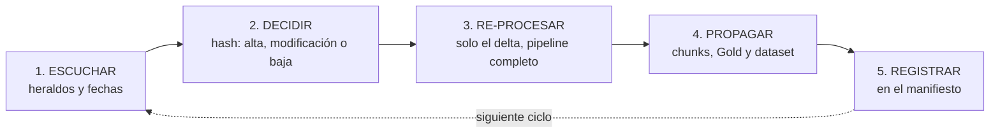

# Capítulo 20: Mantener el Rack al día: alimentar sin ensuciar

## El Rack nació caducado ayer

De esto nunca habla nadie. Los tutoriales explican con detalle cómo *ingerir* — cómo descargar, cómo trocear, cómo embeber — y luego el tema se desvanece, como si el corpus fuese una foto fija. Pero la organización es un río: la norma cambia, la política se actualiza, el convenio se revisa, el procedimiento que el sistema acaba de aprender está obsoleto en la carpeta de origen. **El Rack nació caducado el día después de la primera ingesta** — y cada día que pasa sin un mecanismo de actualización, caduca un poco más, sin dar señal alguna.

Tampoco se habla de esto porque su tratamiento honesto asusta: en las arquitecturas corrientes, actualizar es casi tan caro como construir. Re-ingerir significa re-curar, re-clasificar, re-trocear, re-embeber — y de ahí las dos salidas habituales, ambas malas: o el Rack se congela ("ya lo actualizaremos algún día") o se actualiza a parches, a mano, metiendo en el índice lo nuevo sin retirar bien lo viejo — que es la fábrica de fantasmas del prólogo, ahora con operador.

La tesis de este capítulo es optimista y exigente a la vez: **mantener al día es factible y barato — si el concepto de idempotencia se usó de forma adecuada durante toda la definición del método.** No es una funcionalidad que se añade al final: es una consecuencia que se hereda del diseño. Si la cadena del capítulo 1 se construyó de verdad — la huella decide, la re-ingesta sustituye, la baja retira — entonces "mantener al día" significa *ejecutar el pipeline otra vez, solo sobre lo que cambió*. Si no se construyó, cada actualización es un proyecto nuevo, y siempre habrá algo más urgente que un proyecto nuevo.

## El ciclo de frescura: cinco tiempos

Mantener el Rack al día es un ciclo de cinco tiempos, recurrente y con dueños:

1. **Escuchar.** Detectar cambios en las fuentes del mapa (cap. 3). Los mecanismos, por orden de fiabilidad: el **responsable de la fuente avisa** — el heraldo, que es el mejor detector que existe y el más barato —; la observación de fechas de modificación en las fuentes de alta volatilidad; los barridos programados para el resto. Y un calendario de la realidad: los convenios se revisan en su temporada, las leyes cambian cuando cambian — el ciclo de frescura tiene calendario, no solo frecuencia.
2. **Decidir.** Contrastar el origen con el manifiesto: **alta, modificación o baja** — las tres operaciones del capítulo 18, con el hash como árbitro. La huella decide, no la costumbre: documento sin cambios → nada se toca; documento cambiado → se procesa el delta; documento desaparecido → sale del Rack. Sin excepciones "por si acaso": re-ingestar sin cambio de hash es cómo empieza el ruido.
3. **Re-procesar.** El delta entra al pipeline **completo** — las mismas puertas, el mismo curado, la misma clasificación, el mismo chunking. No existe el *carril rápido*: todo documento que salte fases por urgencia es ruido con fecha de entrada. La modificación, ya dicho, es sustitución del conjunto: los chunks viejos se retiran, los nuevos entran (caps. 10 y 18).
4. **Propagar.** Actualizado el Silver, se comprueban los **derivados**: ¿algún Gold qued invalidado por el cambio? El convenio revisado obliga a su experto a re-validar la síntesis de "condiciones económicas" — la capa human-guided (cap. 14) tiene, también, deber de mantenimiento. ¿El cambio reveló preguntas nuevas para el dataset áureo (cap. 16)? Se añaden. La frescura no acaba en el índice: baja hasta la última capa derivada.
5. **Registrar.** El manifiesto recoge qué entró, cuándo, qué se retiró y por qué. La biografía del corpus maestro — que es lo que lo convierte en capital, cap. 19 — se escribe en cada ciclo.

El ciclo, en diagrama:



## Modificar el corpus maestro de forma eficiente

La frescura no es solo *recibir* cambios de las fuentes: también es **corregir el maestro** — reparar un OCR pésimo, incorporar el anexo que faltaba, corregir una vigencia mal asignada, mejorar una descripción que el diagnóstico del capítulo 17 señalizó. Todo eso es legítimo y necesario. La regla que separa la eficiencia del despilfarro es una sola:

> **El corpus maestro se modifica por la puerta del pipeline — jamás a mano en el índice.**

La paradoja es contraintuitiva y conviene destilarla. Parchear el índice *parece* rápido: se corrige el chunk, se re-embebe, listo. Pero esa corrección vive solo hasta la próxima reconstrucción — y ya sabemos que habrá reconstrucciones (el patrón A→B, las recargas completas) — y muere sin heredar nada. Corregir el maestro *parece* más lento: tocar el documento en Bronce/Silver, dejar nota, re-procesar el documento. Pero esa corrección **se propaga a todos los consumidores y a todas las reconstrucciones futuras** — es trabajo hecho una vez que trabaja para siempre. La corrección del índice alimenta solo a sí misma; la del maestro alimenta al sistema entero. Lo lento que hereda siempre acaba siendo más rápido que lo rápido que se pierde.

Y aquí la idempotencia cobra su salario: como toda modificación pasa por el pipeline, **el mecanismo de corrección y el mecanismo de actualización son el mismo** — no hay dos procesos que mantener, dos criterios que conciliar, dos lugares donde una corrección puede quedarse sin propagar.

## El corpus en Git: el activo versionado

Todo lo anterior — custodia del maestro (cap. 19), modificación eficiente, ruido cero — tiene una implementación natural que conviene declarar, porque de teoría a infraestructura media solo una palabra: **Git**. El corpus maestro vive en un repositorio, versionado como el código serio que el capítulo 19 pedía; y el flujo de actualización se convierte en esto:

1. `git pull` — el maestro al día.
2. Analizar el cambio: alta, modificación o mejora editorial de un documento.
3. Trabajarlo por el método: a Bronce, a Silver, crear o modificar su Gold si procede.
4. `commit` y `push` — en rama, con revisión.
5. Al integrar en `master`, la **CD** descarga el repo y ejecuta el chunking, la ingesta idempotente y la suite (cap. 22). Si falla, no-deployment: master queda correcto para reintentar.

Cada exigencia del método se convierte en mecánica automática:

| Exigencia del método | Lo que Git da gratis |
|---|---|
| Las tres operaciones de sincronización (cap. 18) | Son `git add` / `git diff` / `git rm` — el delta entre commits **es** el delta de ingesta |
| Custodia del maestro (cap. 19) | Historial completo, remoto como copia, cada cambio con autor y fecha |
| Reversibilidad | `revert` a nivel de corpus; con índice blue-green detrás, trivial |
| La regla del "proceso esquivado" (cap. 15) | **Ramas protegidas la hacen imposible**: el proceso son las ramas |
| Las puertas de calidad (Ap. D) | El PR: auditoría y checks en la rama, antes del merge |

### La estructura de carpetas es la taxonomía

Y la parte más elegante de la implementación: la clasificación del cap. 9 puede declararse **por colocación**. La carpeta raíz es el dominio; cada carpeta anidada es una etiqueta; el documento vive donde le corresponde — moverlo es clasificarlo, y las etiquetas no se pueden escribir mal porque son carpetas. El caso real de este libro:

```
convenios-laborales/                                              ← dominio
└── estatales/                                                    ← label
    └── 99000155011981_Convenio_Colectivo_de_Agencias_de_Viajes/  ← label (entidad)
        ├── master.md                    ← el canónico, fuente de verdad textual
        ├── curado.md                    ← lo que se ingesta
        ├── gold_condiciones_economicas.md
        └── 2025/                        ← label (año)
            └── revision_salarial_2025.md
```

La regla de la ingesta es determinista: **carpeta raíz = dominio; cada nivel anidado = una label** que hereda el documento. La revisión salarial de 2025 entra al Rack como `convenios-laborales` + `estatales` + el convenio + `2025`; el master, solo hasta el convenio. Cuanto más profunda la ruta, más específica la clasificación — jerarquía facetada declarada por estructura, navegable a ojo en cualquier explorador. Y un detalle que vale oro: la carpeta con el código del convenio es, en la práctica, un **nodo de entidad** — el grafo del epílogo, construyéndose sin llamarlo así.

Las facetas **mutables u ortogonales** — `vigencia`, confidencialidad, idioma — no van en la ruta (cambiarlas movería archivos; combinarlas la multiplicaría): viajan en la **cabecera de metadatos del propio .md** (front-matter), y la ingesta fusiona ruta y cabecera. Es el sitio natural, además, de los campos del Gold: `concepto_unico`, `resuelve_conflictos`, `fuentes_enlazadas` y el autor viajan en la cabecera de su .md, en la misma rama, en el mismo commit (cap. 15).

Una variante reconocida sobre este árbol: los archivos **Gold** pueden vivir en una **carpeta-capa propia** (`documentos-curados/`) en lugar de junto a sus fuentes — un catálogo centralizado de las verdades que hace trivial la auditoría de duplicados. Si se usa, esa carpeta es una **capa, no un dominio**: la ingesta toma la identidad semántica del Gold (dominios reales, labels, `SINTESIS_CURADA`) de su cabecera de metadatos, no de la ruta, y el índice de dominios debe declararla como capa. Las condiciones completas de las dos variantes de colocación, en el cap. 15.

### Las decisiones por escrito

Con Git hay seis decisiones que conviene tomar antes, porque separan "tenemos el corpus en un repo" de "lo tenemos bien":

1. **Qué se versiona**: el texto (canónico, curado, Gold) es perfecto para Git; los binarios originales se custodian fuera — en almacenamiento local o de objetos — con el **JSON de orígenes comiteado al repo** (es texto, es el linaje del cap. 5). Y ojo con la promesa "redescargable": si el origen muere, el master.md conserva el contenido, pero se pierde la capacidad de re-extraerlo mejor. Custodia del Bronce local: copia verificada y verificación periódica de hashes (cap. 19).
2. **Estados editoriales frente a estados de pipeline**: lo editorial (documentos, clasificación, notas) vive en el repo; los estados de proceso (`AUDITED`, `VALIDATED`) los escribe la CD como artefactos — o los comitea un bot con guardas, para que el bot no dispare al bot.
3. **RGPD e historia inmutable**: todo lo comiteado vive en la historia para siempre. La frontera del cap. 9 (la exclusión PII es *pre-ingesta*) se vuelve aquí literal: un documento sensible que entró al repo no se borra — obliga a reescribir la historia. Con Git, la exclusión no admite ni un despiste.
4. **El índice no está en Git — y eso es correcto**: el repo es el código fuente del conocimiento; el índice, el derivado que la CD regenera. El marcador *último-commit-ingestado* convierte cada despliegue en un `diff` entre ese commit y HEAD.
5. **Gold en ramas = la capa human-guided hecha procedimiento**: el experto escribe en su rama, otro revisa el PR, el merge dispara el UPSERT por `concepto_unico`. La firma y la revisión del cap. 14 se convierten en review obligatoria.
6. **La captura externa sigue siendo script**: las fuentes sin persona detrás (boletines, SharePoint) entran al repo vía el `captura` del cap. 22 — bot con guardas. El repo es el maestro; el mapa de fuentes alimenta al maestro, nunca directo al índice.

La suma de todo: con ramas protegidas, la pregunta "¿y si alguien se salta el proceso?" deja de existir — **no se puede**. La gobernanza deja de ser disciplina y se convierte en mecánica.

## Por qué la re-ingestión idempotente no mete ruido

El título del capítulo es una promesa verificable. Alimentar el Rack continuamente suena — con razón — a receta para el desastre: más ingesta, más duplicados, más versiones conviviendo, más zombis. Eso es exactamente lo que pasa **sin** idempotencia. Con ella, las tres garantías del método (cap. 18) sostienen la promesa:

- **Ni de más**: re-ingestar un documento sin cambios no añade nada — el hash lo corta en la puerta. El ruido por repetición es estructuralmente imposible.
- **Ni de menos**: una baja en origen retira sus chunks del índice. El ruido por residuo es estructuralmente imposible.
- **Ni mezclado**: una modificación sustituye el conjunto — nunca conviven la versión 2024 y la 2025 del mismo documento como si ambas contaran. El ruido por coexistencia es estructuralmente imposible.

Por eso la frase completa del método: **con idempotencia, mantener al día no solo es factible — es la forma de alimentar el RAG sin incluir ruido.** La frescura y la limpieza no son dos objetivos en tensión: son el mismo diseño mirado desde dos ángulos. Y su contraste también es simétrico: la actualización sin idempotencia es contaminación gradual — cada ciclo de frescura ensucia un poco más, hasta que el Rack "actualizado" es más mentiroso que el congelado.

## Los KPIs de la frescura

Lo que no se mide, caduca. Cuatro métricas convierten el mantenimiento en un programa gobernado:

| KPI | Qué mide | Objetivo |
|---|---|---|
| **Edad del corpus** | Tiempo medio desde la última verificación de cada fuente | Menor que la cadencia definida por dominio |
| **Latencia de actualización** | Tiempo entre el cambio en origen y su reflejo en el Rack | Horas o días, según criticidad del dominio |
| **Cobertura de fuentes vivas** | % de fuentes del mapa (cap. 3) con monitorización activa y heraldo identificado | 100% de las fuentes `vigentes` del alcance |
| **Ruido de re-ingesta** | Re-ingestas disparadas sin cambio real de hash | **Cero** — cada una señala un disparador mal afinado |

Las dos primeras se fijan por dominio con su propietario — no todo conocimiento exige la misma frescura. La cuarta es la guardiana del "sin ensuciar": cada re-ingesta sin cambio de hash es un disparador por fechas o por nerviosismo que debe afinarse antes de que fabrique trabajo inútil.

## Quién lo hace: el curador de dominio

La frescura no es tarea del pipeline: es un **contrato entre dos roles**. El **arquitecto** mantiene la maquinaria — pipeline, manifiesto, KPIs, suite. Y cada **propietario de dominio** (la ficha del capítulo 2 ya lo nombraba) ejerce de **curador de dominio**: conoce sus fuentes, recibe sus avisos, dispara los deltas y — sobre todo — mantiene el Gold de su dominio, porque las síntesis caducan igual que las fuentes y su re-validación exige al experto que las firmó. La maquinaria sola no sabe que el convenio se revisó en enero; el experto solo no puede re-procesar dos mil documentos. La frescura vive en el puente: el experto escucha y avisa; el pipeline decide, sustituye y registra.

## Errores frecuentes en la frescura

**El Rack congelado.** Ingesta única, admiración perpetua. La muerte más lenta y más común: el sistema funciona, responde con soltura — sobre el mundo de hace dos años. Nadie lo desactivó; simplemente dejó de decir la verdad sin anunciarlo.

**La actualización heroica.** Una vez al año, reunión de voluntarios, re-ingesta masiva con pizza. Aparte del coste, tiene dos defectos letales: los usuarios viven once meses con fantasmas, y la operación masiva — sin la disciplina de rutina — es donde entran los errores que la rutina habría evitado.

**El parche en el índice.** "Este documento mal, lo corrijo yo ahora en el índice y listo." Corrección muerta al nacer: no está en el maestro, no sobrevivirá a la siguiente reconstrucción, y el maestro seguirá equivocado — fabricando el mismo parche para el siguiente técnico.

**El heraldo único.** La frescura entera depende de la memoria de una persona. Cuando está de vacaciones, los fantasmas se acumulan; cuando se va de la empresa, el sistema se congela sin que nadie lo declare. El heraldo es valioso; el proceso de heraldos — mapas, propietarios, calendarios, KPIs — es imprescindible.

!!! quote "Regla del capítulo"
    mantener al día no es una tarea que se añade: es una consecuencia que se hereda. Si el método es idempotente, alimentar el Rack es barato y limpio; si no lo es, cada actualización es un proyecto nuevo — y siempre habrá algo más urgente que financiarlo.

